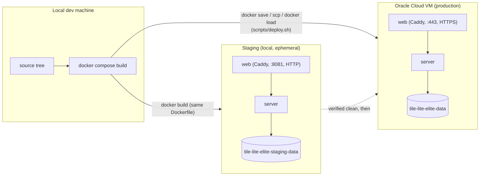

# Architecture

## System Overview

The project is split into a server and two client types:

```
Backend (port 3000)   ←→   Web UI (port 8080, WASM in browser)
                      ←→   Desktop UI (native window)
```

The backend owns all game state, rule enforcement, scoring, and persistence; clients are thin presentation layers that call the server API. This is the current concrete shape (see [1.2 Components and Interactions](1.2-components-and-interactions.md) for the fuller component/sequence diagrams, and [4.1 Configuration](4.1-configuration.md#environments) for exactly what's deployed where) — the rest of this document is the design rationale and roles behind it, some of it still aspirational (see the "should" language throughout).

**Deployment topology** — how a change moves from a developer's machine through to production, and where each environment actually lives:



The same `Dockerfile` produces every image in every environment — staging and production never diverge in what's built, only in how it's configured (`docker-compose.staging.yml` vs `docker-compose.yml`) and where it runs. See [3.3 Testing & Staging](3.3-testing-and-staging.md) and [3.4 Deployment](3.4-deployment.md) for the actual commands.

## Guiding Principle

The server is authoritative.

All game state, scoring, move validation, turn order, endgame decisions, and supported language word lists are decided by the server. The same pure rules code should also be compiled into clients and engine proxies so they can preview legality and score before a move is submitted.

The server remains the final source of truth. Client-side and proxy-side rules are for prediction, feedback, and UX only.

The rules model and the engine model should stay separate. Shared data such as board state, tile racks, move history, and word-list lookups belongs in the rules layer. Engine-specific concerns such as search state, heuristics, tuning parameters, and cached evaluations belong in an engine layer that can depend on the shared rules data but not vice versa.

This project is a hobby project with a strong preference for zero-cost or near-zero-cost hosting. That pushes the design toward simple deployment targets, low operational overhead, and options that can run locally or on free tiers without depending on managed infrastructure that requires ongoing payment.

## Main Roles

### Game Manager

A game manager creates and configures a match.

Responsibilities:

- create a game
- choose board variant and rules
- assign players or engines to seats
- start, pause, resume, or cancel the match
- manage visibility and invitations

### Game Participant

A participant acts within a running game.

Responsibilities:

- place tiles
- pass
- exchange tiles
- resign
- reconnect to an existing session
- view history and current state

## Client Types

Clients should be presentation layers plus local preview logic.

Expected client types:

- web
- desktop
- CLI
- mobile

These clients talk to the same server API and share the same pure rules library so they can show legal-move feedback and score previews without owning canonical state.

## Engine Execution Model

Computer engines run on the server, not in the client.

A client can request that a seat be controlled by an engine, but the actual move generation happens through a server-side proxy layer.

That proxy layer isolates the game engine contract from transport and client concerns, and it can use the shared rules library to evaluate candidate moves before forwarding them to the authoritative server.

## Suggested Boundaries

- `rules/shared`: pure Scrabble rules, move generation helpers, scoring, legality, previews, and per-language word lists
- `rules/core`: board, scoring, tile distribution, legality
- `engine/core`: engine search, heuristics, move selection, and engine-only metadata
- `server/game`: game lifecycle, turn sequencing, persistence
- `server/engines`: engine registry and proxy adapters
- `api`: request/response types shared by clients and server
- `clients/*`: web, desktop, CLI, mobile presentation code

## Non-Goals For The UI Layer

The UI should not own canonical game rules or persistence.

It should still use the shared rules library to preview whether a move is legal and what it would score, but the server must revalidate every move.

## Deployment Bias

Prefer deployment shapes that can be run for free or near-free:

- local development and self-hosting first
- single-server deployment over a distributed service mesh
- minimal managed dependencies
- static or lightweight clients where possible
- optional offline or LAN-friendly operation for demos and testing

## Persistence Model

The server should persist canonical game state in a single SQLite database file per environment. SQLite sidecar files such as `-wal` and `-shm` may appear during normal operation when write-ahead logging is enabled.

Persistence should cover durable match state, move history, engine and player metadata, and saved-game records. UI state, engine search state, and other transient previews should remain in memory or be recomputed.
