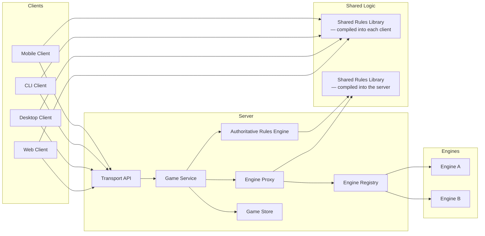
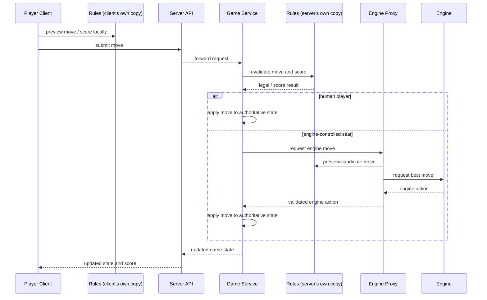

# Components And Interactions

This document sketches the first-pass component model and the main interaction flows for the final Tile Lite Elite system.

## Component Diagram

Same source crate (`rules-shared`), but **two independently compiled copies with no runtime connection between them** — a client's box and the server process each get their own, linked in at their own build time. A client's copy is for prediction only and is never consulted by the server; the server's copy is what actually decides legality and score. This is also why the sequence diagram below uses two separate "Rules" participants rather than one shared box.

## Interaction Diagram: Playing A Move

`RC` and `RS` are the client-side and server-side instances of the same `rules-shared` crate — `P->>RC` is an in-process call on the player's own device, entirely separate from `G->>RS`/`X->>RS` on the server. Nothing here is a network hop or a shared object between client and server; the client's preview and the server's revalidation are two independent computations that happen to run the same code.

## Interaction Notes

- The shared rules library is compiled independently into each client and into the server (the engine proxy uses the server's copy, being part of the same process) — separate binaries, separate copies, no shared running instance between them.
- The shared rules library includes the per-language word list; current support is SOWPODS.
- The rules layer and the engine layer are separate concerns; engines can use rules data as input, but engine search state is not part of the shared rules model.
- The server remains authoritative for the final legality and scoring decision.
- Clients and proxies use shared rules only for prediction, feedback, and move evaluation before submission.
- Engine-vs-engine games use the same proxy path as human-vs-engine games.
- **The "Engine Proxy" and "Engine Registry" boxes above are in-process Rust modules within `server-game`, not separate services** — `G->>X` in the sequence diagram is a plain function call (`maybe_run_engine_turn`), not a network hop. An engine's chosen action flows through the exact same `apply_*` methods a human client's HTTP action does, so the server stays authoritative either way; there's just no OS-process or IPC boundary between "Game Service" and "Engine". See `1.3-technology-decisions.md`'s Engine boundary row for the reasoning (type safety and simplicity over sandboxing, given the only engine author is the project owner).
