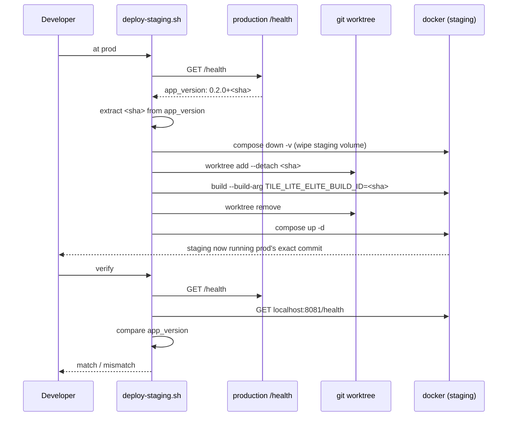

# Testing & Staging

Verifying a change before it ships: automated tests, then a full
containerized rehearsal in the local staging environment. Part of the
lifecycle series — see [docs/README.md](README.md) for the full sequence.
Follows [Development](3.2-development.md), precedes
[Deployment](3.4-deployment.md).

## Running Tests

```bash
cargo test --workspace
```

Runs every crate's tests, including the `old-crates/*` prototypes (harmless — see [1.4 Roadmap](1.4-roadmap.md)'s "CLI Prototype" step). To run just one crate:
```bash
cargo test -p rules-shared    # rules/scoring/validation unit tests
cargo test -p server-game     # HTTP-level integration tests against the real Axum router
cargo test -p tile-lite-elite-ui     # move-composer logic, game-creation seat presets
cargo test -p engine-core     # engine tests
```

No test coverage for `admin-cli` (it's a thin HTTP client with no logic of its own to test in isolation) or for the WASM target specifically — `cargo test` always runs against the host target, not `wasm32-unknown-unknown`; see [Development](3.2-development.md#manual-web-client) for how to sanity-check a WASM build compiles.

## Staging Environment

`docker-compose.staging.yml`, `Caddyfile.staging`, and `scripts/deploy-staging.sh` run the exact same images `scripts/deploy.sh` would ship to production, but locally (e.g. inside WSL), against their own persistent volume — the point being to catch "does this migration actually apply, does the server boot" before either ever reaches the real VM. It's a standalone compose file rather than a `docker-compose.yml` *override*: Compose's list-field merge (concatenate, not replace) makes an override an easy way to silently end up binding host ports 80/443 anyway, and the staging shape (no TLS, no domain, different host port, no cert volumes) already diverges enough from production that a full copy is clearer. See [4.1 Configuration](4.1-configuration.md#environments) for staging's place alongside the other two environments.

```bash
./scripts/deploy-staging.sh              # build + (re)start the staging stack
./scripts/deploy-staging.sh down         # stop it, keep its data
./scripts/deploy-staging.sh reset        # stop it and wipe its data
./scripts/deploy-staging.sh at <git-ref> # wipe + deploy a specific commit/tag/branch
./scripts/deploy-staging.sh at prod      # wipe + deploy whatever commit production is running
./scripts/deploy-staging.sh verify       # confirm staging is running the same version as production
```

Staging is reachable at `http://localhost:8081` — deliberately not `8080` (the local dev web server's port), so the two can run side by side. Plain HTTP, no domain, since there's nothing to provision a Let's Encrypt certificate against locally (`Caddyfile.staging` is `Caddyfile`'s same routing on a bare `:80` block instead). Its database lives on its own volume (`tile-lite-elite-staging-data`), entirely separate from production's.

**Why the volume persists across runs**: re-running `deploy-staging.sh` against an already-seeded staging DB is what actually exercises "does a new migration apply cleanly to an *existing* database" — a fresh volume would only ever apply every migration to nothing, proving much less ([4.2 Database Schema](4.2-database-schema.md)'s "Schema migrations" note has the incident history this guards against). `reset` wipes it deliberately, for when a clean slate actually is wanted. To test against a realistic copy of production data rather than whatever staging has organically accumulated, restore a production backup into `tile-lite-elite-staging-data` first, using the same backup/restore approach as [3.5 Production Support & Maintenance](3.5-production-support.md#backups) above, naming the staging volume instead.

**`at <git-ref>`** wipes the staging volume, then builds from that ref instead of the current working tree, via a throwaway `git worktree` (`mktemp -d` + `git worktree add --detach`, always removed on exit — the real checkout/branch/uncommitted changes are never touched). Since `sqlx::migrate!("./migrations")` is a compile-time macro, the resulting image only knows about whichever migrations existed in the repo at that exact commit — a genuine "start empty, replay migrations up to here," useful for checking an old release's actual behavior or bisecting a migration chain.

**`at prod`** does the same but finds the ref itself, by reading `app_version` off `https://tileliteelite.com/health` and extracting its `+<short-sha>` suffix (override the URL with `PROD_URL`); **`verify`** does the read-only half alone, diffing staging's and production's live `app_version` with no side effects — run it before trusting staging as a stand-in for prod, in case it's quietly drifted since the last `at prod`. Both fail loudly, not silently, if production's `/health` has no `app_version` (a build made outside the deploy scripts, so it never got a commit tag).



This is also the practical answer to "can a bad migration be reverted": not in place — `sqlx::migrate!` only applies pending "up" migrations, and per the migrations `README.md`'s own rule, editing or deleting an already-applied migration file makes the server **refuse to boot** rather than undo anything. The real revert is at the volume level: wipe and redeploy at the last known-good ref, or restore a pre-migration volume snapshot.

**Workflow for a schema change**: write the migration, verify it locally against the dev DB, `at prod` to bring staging to exactly what's live, then a plain `deploy-staging.sh` to apply the new migration on top of that — the realistic "existing database gets a new migration" case — and only then move on to [3.4 Deployment](3.4-deployment.md).
