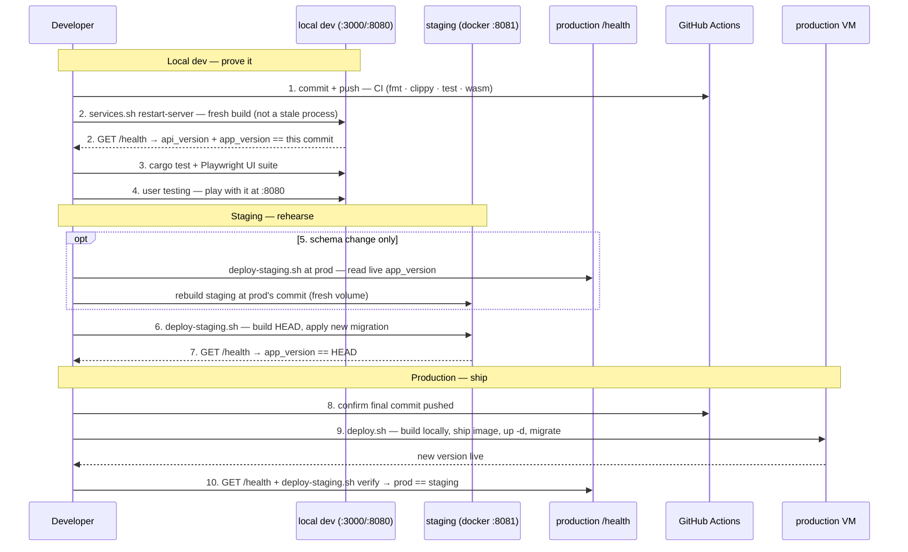

# Testing, CI & Release

Verifying a change and shipping it, end to end: automated tests and CI, a full
containerized rehearsal in the local staging environment, then the release to
production — the whole pipeline in one place, with the ordered command runbook
and a single sequence diagram below. Part of the lifecycle series — see
[docs/README.md](README.md) for the full sequence. Follows
[Development](3.2-development.md). Once a version is live,
[Production Environment & Operations](3.4-production-environment.md) covers the
running system this pipeline ships onto (container topology, secrets,
inspecting and maintaining it) — the steady state, not the release procedure.

## Running Tests

```bash
cargo test --workspace
```

Runs every crate's tests, including the `old-crates/*` prototypes (harmless — see [1.4 Roadmap](1.4-roadmap.md)'s "CLI Prototype" step). To run just one crate:
```bash
cargo test -p rules-shared    # rules/scoring/validation unit tests
cargo test -p server-game     # HTTP-level integration tests against the real Axum router
cargo test -p tile-lite-elite-ui     # move-composer logic, game-creation seat presets
cargo test -p engine-core     # engine tests
```

No test coverage for `admin-cli` (it's a thin HTTP client with no logic of its own to test in isolation) or for the WASM target specifically — `cargo test` always runs against the host target, not `wasm32-unknown-unknown`; see [Development](3.2-development.md#manual-web-client) for how to sanity-check a WASM build compiles.

## Continuous Integration

`.github/workflows/ci.yml` runs the same checks on GitHub Actions — on every
push (any branch), on pull requests, and on demand from the Actions tab. One
job runs four steps, in order:

1. **Format** — `cargo fmt --check` on this repo's crates.
2. **Clippy** — `cargo clippy --workspace --exclude first-try --exclude second-try --all-targets -- -D warnings`. Any clippy or compiler warning fails the build. The lint gate covers this repo's crates only; the `old-crates/*` archive is excluded (it carries pre-existing warnings that aren't maintained).
3. **Test** — `cargo test --workspace` (includes `old-crates/*`, whose tests still pass).
4. **Wasm build** — `cargo build -p tile-lite-elite-ui --target wasm32-unknown-unknown`, so wasm-only breakage is caught even though the host-target steps above can't see it. This is a plain cargo compile of the default `web` feature, not the full `dx`/`wasm-bindgen` packaging the Docker release build runs.

Notes:

- The job sets `RUSTC_WRAPPER=""` to disable the sccache wrapper that `.cargo/config.toml` configures for local dev (sccache isn't on the runner and is incompatible with wasm) while keeping that file's wasm32 rustflags.
- CI resolves the `srm-utils` git dependency (used only by `old-crates`) from the public `github.com/SteveStyle/utils` repo — no token needed as long as that repo stays public.
- CI is a signal, not a deploy gate: it runs *after* a push, in parallel with the local staging rehearsal below. `scripts/deploy.sh`'s own pre-flight checks (clean tree, pushed HEAD, staging on the same commit) remain the actual guard before production.

## Staging Environment

`docker-compose.staging.yml`, `Caddyfile.staging`, and `scripts/deploy-staging.sh` run the exact same images `scripts/deploy.sh` would ship to production, but locally (e.g. inside WSL), against their own persistent volume — the point being to catch "does this migration actually apply, does the server boot" before either ever reaches the real VM. It's a standalone compose file rather than a `docker-compose.yml` *override*: Compose's list-field merge (concatenate, not replace) makes an override an easy way to silently end up binding host ports 80/443 anyway, and the staging shape (no TLS, no domain, different host port, no cert volumes) already diverges enough from production that a full copy is clearer. See [4.1 Configuration](4.1-configuration.md#environments) for staging's place alongside the other two environments.

```bash
./scripts/deploy-staging.sh              # build + (re)start the staging stack
./scripts/deploy-staging.sh down         # stop it, keep its data
./scripts/deploy-staging.sh reset        # stop it and wipe its data
./scripts/deploy-staging.sh at <git-ref> # wipe + deploy a specific commit/tag/branch
./scripts/deploy-staging.sh at prod      # wipe + deploy whatever commit production is running
./scripts/deploy-staging.sh verify       # confirm staging is running the same version as production
```

Staging is reachable at `http://localhost:8081` — deliberately not `8080` (the local dev web server's port), so the two can run side by side. Plain HTTP, no domain, since there's nothing to provision a Let's Encrypt certificate against locally (`Caddyfile.staging` is `Caddyfile`'s same routing on a bare `:80` block instead). Its database lives on its own volume (`tile-lite-elite-staging-data`), entirely separate from production's.

**Why the volume persists across runs**: re-running `deploy-staging.sh` against an already-seeded staging DB is what actually exercises "does a new migration apply cleanly to an *existing* database" — a fresh volume would only ever apply every migration to nothing, proving much less ([4.2 Database Schema](4.2-database-schema.md)'s "Schema migrations" note has the incident history this guards against). `reset` wipes it deliberately, for when a clean slate actually is wanted. To test against a realistic copy of production data rather than whatever staging has organically accumulated, restore a production backup into `tile-lite-elite-staging-data` first, using the same backup/restore approach as [3.4 Production Environment & Operations](3.4-production-environment.md#backups) above, naming the staging volume instead.

**`at <git-ref>`** wipes the staging volume, then builds from that ref instead of the current working tree, via a throwaway `git worktree` (`mktemp -d` + `git worktree add --detach`, always removed on exit — the real checkout/branch/uncommitted changes are never touched). Since `sqlx::migrate!("./migrations")` is a compile-time macro, the resulting image only knows about whichever migrations existed in the repo at that exact commit — a genuine "start empty, replay migrations up to here," useful for checking an old release's actual behavior or bisecting a migration chain.

**`at prod`** does the same but finds the ref itself, by reading `app_version` off `https://tileliteelite.com/health` and extracting its `+<short-sha>` suffix (override the URL with `PROD_URL`); **`verify`** does the read-only half alone, diffing staging's and production's live `app_version` with no side effects — run it before trusting staging as a stand-in for prod, in case it's quietly drifted since the last `at prod`. Both fail loudly, not silently, if production's `/health` has no `app_version` (a build made outside the deploy scripts, so it never got a commit tag).

This is also the practical answer to "can a bad migration be reverted": not in place — `sqlx::migrate!` only applies pending "up" migrations, and per the migrations `README.md`'s own rule, editing or deleting an already-applied migration file makes the server **refuse to boot** rather than undo anything. The real revert is at the volume level: wipe and redeploy at the last known-good ref, or restore a pre-migration volume snapshot.

### Shipping a change: the full sequence

Run every command from the repo root. Three phases: **local dev** (steps 1–4)
proves the change on your own machine, **staging** (steps 5–7) rehearses the
deploy, and **production** (steps 8–10) ships it. For a change **with a new
migration**, do step 5 (the `at prod` seed) so the migration is exercised
against a real copy of production's schema; for a change with **no migration**,
skip it and let staging reuse whatever data it already has.

#### Local dev — prove it on your own machine

**1. Commit and push the change** — every build below uses a committed HEAD, never a dirty tree. Push right after committing (and after each iteration commit below): it's an off-site backup and lets any issue be tied to an exact commit. CI runs on the push, but it's only a signal running in parallel with the rest — `deploy.sh` (step 9) is the actual production gate, so an early push ships nothing on its own.

Start the subject with the standardized version stamp `app <X.Y.Z> api <M.N>:` — the same `app`/`api` words `GET /health` reports, so a commit and a running server speak one vocabulary (you know exactly what to match when you check `/health` in steps 2, 7, and 10).

```bash
git add -A
git commit -m "app 0.4.6 api 2.1: …"   # version stamp first; commit/amend freely while iterating
git push origin main                    # always push right after committing — backup + traceability
```

**2. Refresh the dev environment** — rebuild and restart so you're testing *this* code, not a process still running an old binary. Default to `services.sh restart`: it refreshes **both** the server and the web client, and each `start`/`restart` kills whatever is bound to `:3000`/`:8080` — even a hand-started or orphaned process the PID file doesn't know about — before starting a fresh `cargo run` / `dx serve`. (`restart-server` refreshes the backend only: quicker, but it leaves the browser on the previously-built web bundle, so use it only when you haven't changed client code — and hard-refresh the tab regardless.)

```bash
./scripts/services.sh restart             # both server + web (the safe default); restart-server = backend only
```

Then **confirm the running server is actually your build** — this one check is the guardrail:

```bash
curl -s http://127.0.0.1:3000/health      # api_version + app_version must match this commit
```

A stale server is silent and costly: a rebuilt client against an old server fails with cryptic wire-type errors (`invalid type: string … expected i64`) that look like a code bug but aren't. Any new migration applies automatically on this restart — the same `sqlx::migrate!` path production uses, so this doubles as a first real-data run of it (watch `.logs/server.log`).

**3. Run the automated suites** — unit/integration plus the end-to-end UI suite, against the dev environment you just refreshed:

```bash
cargo test --workspace
( cd e2e && npm test )     # Playwright UI suite (first run: npm install && npx playwright install chromium)
```

`cargo test` is the Rust unit/integration gate; the Playwright suite (`e2e/`, see [its README](../e2e/README.md)) drives the real web client in a browser against the dev environment you just refreshed — that's what catches client/server *contract* breaks like the timestamp skew, which no Rust test crosses the wire to see. It self-registers `e2e-*` players and purges them on teardown (`scripts/e2e-clean.sh`). CI runs `fmt`/`clippy`/`cargo test`/wasm on the push (step 1) too; running them here first is just the faster local loop.

**4. User testing** — open `http://127.0.0.1:8080` and actually play with the change. This is the exploratory pass the automated suites don't replace — the timestamps-to-integer release's client/server skew surfaced from a single click, not a failing assertion, which is why this step exists.

#### Staging — rehearse the deploy

**5. Seed staging with production's current state** — wipes staging and rebuilds it at whatever commit prod is running, updating database and code. If only code has changed since the last deployment to staging, this step may be skipped.

```bash
./scripts/deploy-staging.sh at prod
```

(`at prod` builds production's own commit in a throwaway worktree, independent
of your working tree; the plain build in step 6 is what needs the commit from
step 1.) When you fix something found in staging and rebuild, a plain step-6
rebuild is enough for a code-only change. Re-run `at prod` first only when
**re-testing a migration**: sqlx won't re-apply — or let you edit — a migration
already applied to the staging volume, so the fix needs a clean prod-state seed
to exercise it.

**6. Build your commit onto the staging volume** — applies any new migration on top of the step-5 seed (a plain run does not wipe the volume):

```bash
./scripts/deploy-staging.sh
```

**7. Confirm staging booted on your commit** — `app_version` should end in your short SHA:

```bash
git rev-parse --short HEAD                                        # the SHA to look for
curl -s http://localhost:8081/health | grep -o '"app_version":"[^"]*"'
```

If anything is wrong, fix it, commit again (step 1), and rebuild (step 6) — re-seeding (step 5) again only if you're re-testing a migration. **Do not run
`verify` yet** — staging is ahead of production at this point, so a mismatch is
expected, not an error.

#### Production — ship it

**8. Confirm HEAD is pushed** — `deploy.sh` requires it. If you pushed each commit at step 1 (you should have), this is already done; run it again to be sure the final fix commit is up:

```bash
git push origin main
```

**9. Deploy to production** — re-checks a clean tree, that HEAD is pushed, and that staging is on this exact commit:

```bash
./scripts/deploy.sh
```

**10. Confirm production matches** — `verify` should now report a match:

```bash
curl -s https://tileliteelite.com/health | grep -o '"app_version":"[^"]*"'
./scripts/deploy-staging.sh verify
```

When you're done, tear down the local staging stack (optional):

```bash
./scripts/deploy-staging.sh reset
```

Once it's live, [3.4 Production Environment & Operations](3.4-production-environment.md) covers running and maintaining it.

Both `deploy-staging.sh` and `deploy.sh` refuse to build from an uncommitted working tree, for the same reason: a build-ID label that doesn't match what's actually in the image is worse than no label at all.

### The pipeline at a glance

The whole flow above as one sequence — numbers match the runbook steps. `deploy.sh`'s internal build-and-ship (build locally → `scp` → `docker load` → `up -d` → `sqlx migrate`) is a single step here; it's spelled out in [How `deploy.sh` ships an image](#how-deploysh-ships-an-image) below.



### How `deploy.sh` ships an image

Step 6 of the runbook above is a single `./scripts/deploy.sh`; here's what it does under the hood. The live VM has 1GB RAM — not enough to compile the Rust/wasm workspace — so images are always built locally and shipped over, never built on the VM itself:

```bash
./scripts/deploy.sh
```

`deploy.sh` refuses to run unless two things are both true: the working tree is clean (it only ever builds a real commit, never uncommitted changes — commit or stash first), and [local staging](#staging-environment) is currently up and running *that exact commit* (checked via its `/health`). The second check exists specifically to catch the easy-to-miss case: test commit A in staging, then commit a "quick fix" B before running `deploy.sh` — without this, B would ship to production having never been tested anywhere. Bring staging to HEAD first (`./scripts/deploy-staging.sh`) if either check fails.

This builds both images locally, `docker save`s and gzips them, `scp`s them plus `docker-compose.yml` to the VM, `docker load`s them there, and runs `docker compose up -d`. Takes a few minutes, almost all of it the local build. Configurable via env vars (`DEPLOY_HOST`, `DEPLOY_USER`, `DEPLOY_SSH_KEY`, `DEPLOY_REMOTE_DIR`) if the target ever changes — see the script header.

CI (`.github/workflows/ci.yml` — see [Continuous Integration](#continuous-integration)) runs the test/lint gate on push, but it is **not** part of deployment: there's no registry and no build-on-push. Deployment stays a manual, on-demand scp/load push from a developer machine, appropriate for a hobby project's actual deploy frequency. Worth revisiting (push to a registry, `docker compose pull` on the VM instead of scp/load) if that ever changes.

Schema changes ship via real, versioned migrations that apply automatically the moment the new server starts — **wiping the database is no longer a normal part of shipping a schema change** (see [4.2 Database Schema](4.2-database-schema.md)'s "Schema migrations" note for why this used to be necessary and isn't anymore). For the rare genuine "start over" case, see [3.4 Production Environment & Operations](3.4-production-environment.md#wiping-production).
