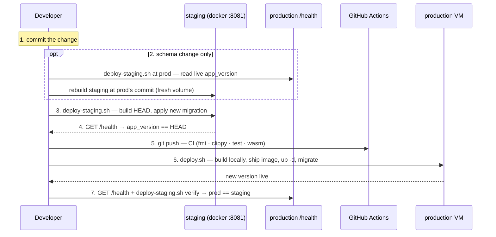

# Testing, CI & Release

Verifying a change and shipping it, end to end: automated tests and CI, a full
containerized rehearsal in the local staging environment, then the release to
production — the whole pipeline in one place, with the ordered command runbook
and a single sequence diagram below. Part of the lifecycle series — see
[docs/README.md](README.md) for the full sequence. Follows
[Development](3.2-development.md); [Deployment](3.4-deployment.md) covers the
production-side machinery (container topology, images, secrets) this pipeline
drives, rather than repeating the procedure.

## Running Tests

```bash
cargo test --workspace
```

Runs every crate's tests, including the `old-crates/*` prototypes (harmless — see [1.4 Roadmap](1.4-roadmap.md)'s "CLI Prototype" step). To run just one crate:
```bash
cargo test -p rules-shared    # rules/scoring/validation unit tests
cargo test -p server-game     # HTTP-level integration tests against the real Axum router
cargo test -p tile-lite-elite-ui     # move-composer logic, game-creation seat presets
cargo test -p engine-core     # engine tests
```

No test coverage for `admin-cli` (it's a thin HTTP client with no logic of its own to test in isolation) or for the WASM target specifically — `cargo test` always runs against the host target, not `wasm32-unknown-unknown`; see [Development](3.2-development.md#manual-web-client) for how to sanity-check a WASM build compiles.

## Continuous Integration

`.github/workflows/ci.yml` runs the same checks on GitHub Actions — on every
push (any branch), on pull requests, and on demand from the Actions tab. One
job runs four steps, in order:

1. **Format** — `cargo fmt --check` on this repo's crates.
2. **Clippy** — `cargo clippy --workspace --exclude first-try --exclude second-try --all-targets -- -D warnings`. Any clippy or compiler warning fails the build. The lint gate covers this repo's crates only; the `old-crates/*` archive is excluded (it carries pre-existing warnings that aren't maintained).
3. **Test** — `cargo test --workspace` (includes `old-crates/*`, whose tests still pass).
4. **Wasm build** — `cargo build -p tile-lite-elite-ui --target wasm32-unknown-unknown`, so wasm-only breakage is caught even though the host-target steps above can't see it. This is a plain cargo compile of the default `web` feature, not the full `dx`/`wasm-bindgen` packaging the Docker release build runs.

Notes:

- The job sets `RUSTC_WRAPPER=""` to disable the sccache wrapper that `.cargo/config.toml` configures for local dev (sccache isn't on the runner and is incompatible with wasm) while keeping that file's wasm32 rustflags.
- CI resolves the `srm-utils` git dependency (used only by `old-crates`) from the public `github.com/SteveStyle/utils` repo — no token needed as long as that repo stays public.
- CI is a signal, not a deploy gate: it runs *after* a push, in parallel with the local staging rehearsal below. `scripts/deploy.sh`'s own pre-flight checks (clean tree, pushed HEAD, staging on the same commit) remain the actual guard before production.

## Staging Environment

`docker-compose.staging.yml`, `Caddyfile.staging`, and `scripts/deploy-staging.sh` run the exact same images `scripts/deploy.sh` would ship to production, but locally (e.g. inside WSL), against their own persistent volume — the point being to catch "does this migration actually apply, does the server boot" before either ever reaches the real VM. It's a standalone compose file rather than a `docker-compose.yml` *override*: Compose's list-field merge (concatenate, not replace) makes an override an easy way to silently end up binding host ports 80/443 anyway, and the staging shape (no TLS, no domain, different host port, no cert volumes) already diverges enough from production that a full copy is clearer. See [4.1 Configuration](4.1-configuration.md#environments) for staging's place alongside the other two environments.

```bash
./scripts/deploy-staging.sh              # build + (re)start the staging stack
./scripts/deploy-staging.sh down         # stop it, keep its data
./scripts/deploy-staging.sh reset        # stop it and wipe its data
./scripts/deploy-staging.sh at <git-ref> # wipe + deploy a specific commit/tag/branch
./scripts/deploy-staging.sh at prod      # wipe + deploy whatever commit production is running
./scripts/deploy-staging.sh verify       # confirm staging is running the same version as production
```

Staging is reachable at `http://localhost:8081` — deliberately not `8080` (the local dev web server's port), so the two can run side by side. Plain HTTP, no domain, since there's nothing to provision a Let's Encrypt certificate against locally (`Caddyfile.staging` is `Caddyfile`'s same routing on a bare `:80` block instead). Its database lives on its own volume (`tile-lite-elite-staging-data`), entirely separate from production's.

**Why the volume persists across runs**: re-running `deploy-staging.sh` against an already-seeded staging DB is what actually exercises "does a new migration apply cleanly to an *existing* database" — a fresh volume would only ever apply every migration to nothing, proving much less ([4.2 Database Schema](4.2-database-schema.md)'s "Schema migrations" note has the incident history this guards against). `reset` wipes it deliberately, for when a clean slate actually is wanted. To test against a realistic copy of production data rather than whatever staging has organically accumulated, restore a production backup into `tile-lite-elite-staging-data` first, using the same backup/restore approach as [3.5 Production Support & Maintenance](3.5-production-support.md#backups) above, naming the staging volume instead.

**`at <git-ref>`** wipes the staging volume, then builds from that ref instead of the current working tree, via a throwaway `git worktree` (`mktemp -d` + `git worktree add --detach`, always removed on exit — the real checkout/branch/uncommitted changes are never touched). Since `sqlx::migrate!("./migrations")` is a compile-time macro, the resulting image only knows about whichever migrations existed in the repo at that exact commit — a genuine "start empty, replay migrations up to here," useful for checking an old release's actual behavior or bisecting a migration chain.

**`at prod`** does the same but finds the ref itself, by reading `app_version` off `https://tileliteelite.com/health` and extracting its `+<short-sha>` suffix (override the URL with `PROD_URL`); **`verify`** does the read-only half alone, diffing staging's and production's live `app_version` with no side effects — run it before trusting staging as a stand-in for prod, in case it's quietly drifted since the last `at prod`. Both fail loudly, not silently, if production's `/health` has no `app_version` (a build made outside the deploy scripts, so it never got a commit tag).

This is also the practical answer to "can a bad migration be reverted": not in place — `sqlx::migrate!` only applies pending "up" migrations, and per the migrations `README.md`'s own rule, editing or deleting an already-applied migration file makes the server **refuse to boot** rather than undo anything. The real revert is at the volume level: wipe and redeploy at the last known-good ref, or restore a pre-migration volume snapshot.

### Shipping a change: the full sequence

Run every command from the repo root. Steps 1–4 are the local staging
rehearsal; steps 5–7 ship it. For a change **with a new migration**, do step 2
(the `at prod` seed) so the migration is exercised against a real copy of
production's schema; for a change with **no migration**, skip step 2 and let
staging reuse whatever data it already has.

**1. Commit the change** — every build below uses a committed HEAD, never a dirty tree:

```bash
git add -A
git commit -m "…"          # commit again / amend freely while iterating
```

**2. Seed staging with production's current state**  — wipes staging and rebuilds it at whatever commit prod is running, updates database and code.  If only code has changed since the last deployment to staging then this step may be skipped.  

```bash
./scripts/deploy-staging.sh at prod
```

Commit *before* seeding, and re-seed per tested commit: if you find something in
staging and commit a fix, run `at prod` again before rebuilding — otherwise step
3 rebuilds onto a volume where the migration is already applied and silently
stops testing it. (`at prod` builds production's own commit in a throwaway
worktree, independent of your working tree; the plain build in step 3 is what
needs the commit from step 1.)

**3. Build your commit onto the staging volume** — applies any new migration on top of the step-2 seed (a plain run does not wipe the volume):

```bash
./scripts/deploy-staging.sh
```

**4. Confirm staging booted on your commit** — `app_version` should end in your short SHA:

```bash
git rev-parse --short HEAD                                        # the SHA to look for
curl -s http://localhost:8081/health | grep -o '"app_version":"[^"]*"'
```

If anything is wrong, fix it, commit again (step 1), and re-run steps 2–3 (re-seed, then rebuild). **Do not run
`verify` yet** — staging is ahead of production at this point, so a mismatch is
expected, not an error.

**5. Push** — required before `deploy.sh`, and the first thing CI runs against:

```bash
git push origin main
```

**6. Deploy to production** — re-checks a clean tree, that HEAD is pushed, and that staging is on this exact commit:

```bash
./scripts/deploy.sh
```

**7. Confirm production matches** — `verify` should now report a match:

```bash
curl -s https://tileliteelite.com/health | grep -o '"app_version":"[^"]*"'
./scripts/deploy-staging.sh verify
```

When you're done, tear down the local staging stack (optional):

```bash
./scripts/deploy-staging.sh reset
```

Then move on to [3.4 Deployment](3.4-deployment.md) for the production-side detail.

Both `deploy-staging.sh` and `deploy.sh` refuse to build from an uncommitted working tree, for the same reason: a build-ID label that doesn't match what's actually in the image is worse than no label at all.

### The pipeline at a glance

The whole flow above as one sequence — numbers match the runbook steps. `deploy.sh`'s internal build-and-ship (build locally → `scp` → `docker load` → `up -d` → `sqlx migrate`) is a single step here; see [3.4 Deployment](3.4-deployment.md) for that machinery.


