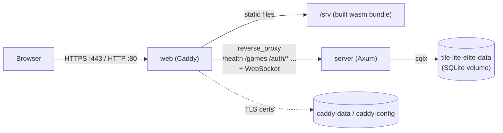
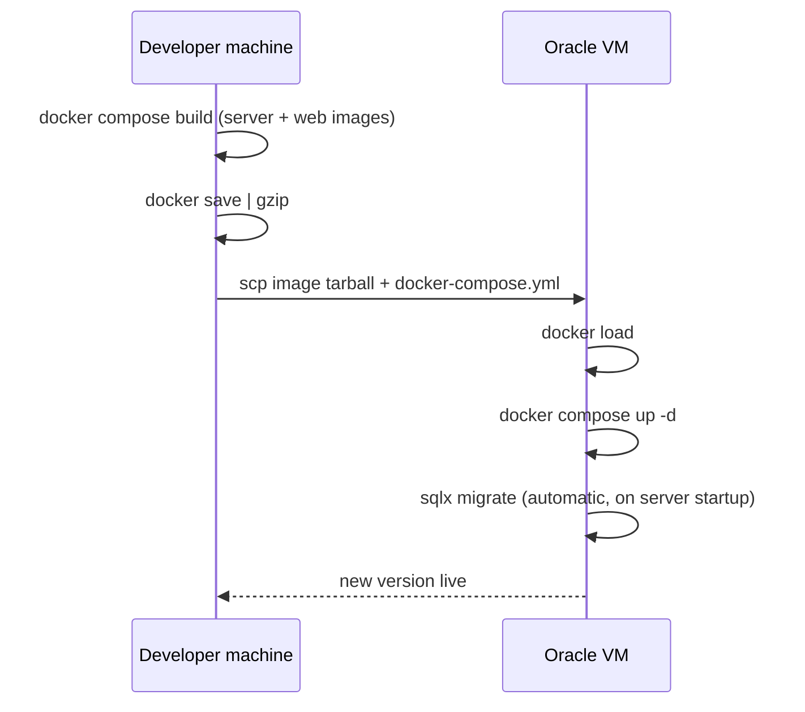

# Deployment

Shipping a built image to the production VM. Part of the lifecycle series —
see [docs/README.md](README.md) for the full sequence. Follows
[Testing & Staging](3.3-testing-and-staging.md), precedes
[Production Support & Maintenance](3.5-production-support.md).

## Container Deployment

`Dockerfile`, `docker-compose.yml`, and `Caddyfile` at the repo root build and run the app as two containers:

- **`server`** — the Axum backend (`server-game`), release-built. Not published to the host; only reachable from `web` over the compose network, and via `docker compose exec`.
- **`web`** — Caddy, serving the release web build (`dx build --platform web --release`) as static files, reverse-proxying API/WebSocket paths to `server`, and handling automatic HTTPS. Published on `:80` and `:443`.

```bash
docker compose build
docker compose up -d
```



Same-origin end to end: the browser only ever talks to Caddy, which serves the static bundle *and* proxies the API/WebSocket from the same origin — see "Why one image serves both" below for why that matters.

SQLite lives on a named volume (`tile-lite-elite-data`, mounted at `/data` in `server`) — it survives `docker compose down` and rebuilds, but not `docker compose down -v`. See [3.5 Production Support & Maintenance](3.5-production-support.md#backups) for backing it up.

Caddy's obtained TLS certificate lives on its own named volumes (`caddy-data`, `caddy-config`) for the same reason — losing them means a fresh certificate request on next start, not a functional problem, just unnecessary churn against Let's Encrypt's rate limits.

**Admin CLI**: `/admin/*` stays loopback-only exactly as it is locally — a request proxied in from the `web` container isn't a loopback connection, so the server rejects it the same as it would over a LAN. See [3.5 Production Support & Maintenance](3.5-production-support.md#admin-cli) for how to reach it here (`docker compose exec server tile-lite-elite-admin ...`) versus against a local dev server — they're not interchangeable.

**Why one image serves both, same-origin**: the web build is compiled with `TILE_LITE_ELITE_API_BASE_URL=""` (explicitly empty, not unset — see the [Configuration table](4.1-configuration.md#environment-variables)), which makes the client derive its API/WebSocket target from whatever origin actually served the page (`crates/ui/src/app.rs`'s `websocket_url`/`same_origin_websocket_url`). That's what lets the same compiled wasm bundle work regardless of the host's IP or domain, with no rebuild needed if either changes — and it sidesteps CORS entirely, since Caddy serves both the static assets and the proxied API from one origin.

**Setting `RESEND_API_KEY`**: `docker-compose.yml` reads it via `${RESEND_API_KEY:-}` substitution, which Compose fills in from a `.env` file it auto-loads from the same directory — *not* from the `environment:` block itself, so the real key never goes anywhere near git. Create it once on the VM (`scripts/deploy.sh` only ever scps `docker-compose.yml` and the image tarball, never `.env`, so this survives every future redeploy untouched — same handling as the deploy SSH key):

```bash
ssh tile-lite-elite
cat > ~/tile-lite-elite/.env <<'EOF'
RESEND_API_KEY=re_your_real_key_here
EOF
cd ~/tile-lite-elite && docker compose up -d   # picks up the new .env immediately
```

Leaving `.env` absent (or `RESEND_API_KEY` unset within it) is a supported, fully-functional state — see `RESEND_API_KEY`'s row in the [Configuration table](4.1-configuration.md#environment-variables).

## Redeploying (after a code change)

The live VM has 1GB RAM — not enough to compile the Rust/wasm workspace — so images are always built locally and shipped over, never built on the VM itself. `scripts/deploy.sh` automates the whole cycle:

```bash
./scripts/deploy.sh
```



This builds both images locally, `docker save`s and gzips them, `scp`s them plus `docker-compose.yml` to the VM, `docker load`s them there, and runs `docker compose up -d`. Takes a few minutes, almost all of it the local build. Configurable via env vars (`DEPLOY_HOST`, `DEPLOY_USER`, `DEPLOY_SSH_KEY`, `DEPLOY_REMOTE_DIR`) if the target ever changes — see the script header.

There's no CI and no registry involved — this is a manual, on-demand push from a developer machine, appropriate for a hobby project's actual deploy frequency. Worth revisiting (e.g. push to a registry, `docker compose pull` on the VM instead of scp/load) if that ever changes.

Schema changes ship via real, versioned migrations that apply automatically the moment the new server starts — **wiping the database is no longer a normal part of shipping a schema change** (see [4.2 Database Schema](4.2-database-schema.md)'s "Schema migrations" note for why this used to be necessary and isn't anymore). For the rare genuine "start over" case, see [3.5 Production Support & Maintenance](3.5-production-support.md#wiping-production).
