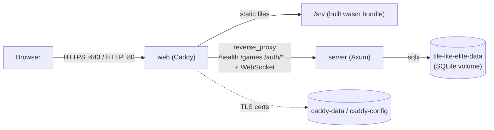
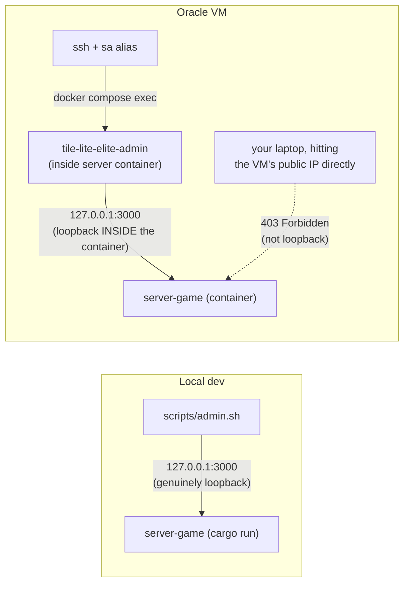

# Production Environment & Operations

The live production system: what actually runs, and how you inspect and
maintain it once a release is out. The release *procedure* that puts a version
here — test → stage → push → deploy → verify, and the `deploy.sh` machinery
under the hood — lives in
[Testing, CI & Release](3.3-testing-ci-and-release.md#shipping-a-change-the-full-sequence);
this doc is the steady state after that, not a second copy of it. Part of the
lifecycle series — see [docs/README.md](README.md) for the full sequence.
Follows [Testing, CI & Release](3.3-testing-ci-and-release.md).

## Container Topology

`Dockerfile`, `docker-compose.yml`, and `Caddyfile` at the repo root run the app as two containers:

- **`server`** — the Axum backend (`server-game`), release-built. Not published to the host; only reachable from `web` over the compose network, and via `docker compose exec`.
- **`web`** — Caddy, serving the release web build (`dx build --platform web --release`) as static files, reverse-proxying API/WebSocket paths to `server`, and handling automatic HTTPS. Published on `:80` and `:443`.



Same-origin end to end: the browser only ever talks to Caddy, which serves the static bundle *and* proxies the API/WebSocket from the same origin — see "Why one image serves both" below for why that matters.

SQLite lives on a named volume (`tile-lite-elite-data`, mounted at `/data` in `server`) — it survives `docker compose down` and rebuilds, but not `docker compose down -v`. See [Backups](#backups) for backing it up and [Inspecting the database](#inspecting-the-database) for reading it.

Caddy's obtained TLS certificate lives on its own named volumes (`caddy-data`, `caddy-config`) for the same reason — losing them means a fresh certificate request on next start, not a functional problem, just unnecessary churn against Let's Encrypt's rate limits.

**Why one image serves both, same-origin**: the web build is compiled with `TILE_LITE_ELITE_API_BASE_URL=""` (explicitly empty, not unset — see the [Configuration table](4.1-configuration.md#environment-variables)), which makes the client derive its API/WebSocket target from whatever origin actually served the page (`crates/ui/src/app.rs`'s `websocket_url`/`same_origin_websocket_url`). That's what lets the same compiled wasm bundle work regardless of the host's IP or domain, with no rebuild needed if either changes — and it sidesteps CORS entirely, since Caddy serves both the static assets and the proxied API from one origin.

**Setting `RESEND_API_KEY`**: `docker-compose.yml` reads it via `${RESEND_API_KEY:-}` substitution, which Compose fills in from a `.env` file it auto-loads from the same directory — *not* from the `environment:` block itself, so the real key never goes anywhere near git. Create it once on the VM (`scripts/deploy.sh` only ever scps `docker-compose.yml` and the image tarball, never `.env`, so this survives every future redeploy untouched — same handling as the deploy SSH key):

```bash
ssh tile-lite-elite
cat > ~/tile-lite-elite/.env <<'EOF'
RESEND_API_KEY=re_your_real_key_here
EOF
cd ~/tile-lite-elite && docker compose up -d   # picks up the new .env immediately
```

Leaving `.env` absent (or `RESEND_API_KEY` unset within it) is a supported, fully-functional state — see `RESEND_API_KEY`'s row in the [Configuration table](4.1-configuration.md#environment-variables).

## Admin CLI

The admin CLI — crate `crates/admin-cli`, binary/command name `tile-lite-elite-admin` — is operator tooling for a running server: list/delete users, reset a password, list/delete/force-end games. It's a thin HTTP client against `server-game`'s `/admin/*` endpoints, not a separate implementation, so it can't drift from what the server actually does (cascading deletes, password hashing, etc. all stay server-side).

**There's no admin account or token.** The `/admin/*` endpoints only accept requests whose peer address is loopback (`127.0.0.1`/`::1`), regardless of what `TILE_LITE_ELITE_BIND` is set to — running the CLI *from the server's own terminal* is the access control. This matters specifically because `TILE_LITE_ELITE_BIND=0.0.0.0:3000` (see [Development](3.2-development.md#manual-backend-only)'s LAN-play example) would otherwise expose these endpoints to the whole LAN, not just the machine running the server. In the container deployment it means the same thing: `/admin/*` stays loopback-only, and a request proxied in from the `web` container isn't a loopback connection, so the server rejects it the same as it would over a LAN. Where you run `tile-lite-elite-admin` *from* isn't a preference, it's the only thing that determines whether it works at all — the two cases below are genuinely different, not interchangeable:

**Local dev server** (running directly on this machine, not in a container):

```bash
./scripts/admin.sh users list
./scripts/admin.sh users reset-password <player_id>          # prints a generated password
./scripts/admin.sh users reset-password <player_id> --password 'a specific one'
./scripts/admin.sh users delete <player_id>

./scripts/admin.sh games list
./scripts/admin.sh games list --status waiting
./scripts/admin.sh games list --older-than-days 30
./scripts/admin.sh games delete <game_id>
./scripts/admin.sh games force-end <game_id>
```

`scripts/admin.sh` builds `admin-cli` in **release** mode and runs that binary — a plain `cargo run -p admin-cli` builds and runs a *debug* binary instead, which still works but is worth avoiding out of habit now that a script exists to do the right thing by default.

**The Oracle VM's (or any container deployment's) server**: `scripts/admin.sh` can't reach it — it always targets `127.0.0.1`, and that's a different loopback than the VM's, by design (see above; pointing `--server`/`TILE_LITE_ELITE_API_BASE_URL` at the VM's public address from your own machine just gets a 403, it isn't a workaround). Run it *inside* the server container instead, where `127.0.0.1` genuinely is that container. An alias `sa` has been set up on the VM so it can be called from any directory.

```bash
ssh -i ~/.ssh/oracle_tile_lite_elite ubuntu@129.151.69.246
sa games list
cd ~/tile-lite-elite
docker compose exec server tile-lite-elite-admin games list
```



That binary is the release build baked into the `runtime-server` image by the `Dockerfile` — there's nothing extra to build or configure on the VM itself.

Deleting a user unclaims their seats (`player_id` set to null on `game_participants`) rather than deleting their games — game history and other players' records survive.

## Inspecting the database

For anything the admin CLI doesn't cover — an ad-hoc query, checking a column value, confirming a migration applied — read the SQLite file directly with the `sqlite3` CLI. The database is `tile-lite-elite.sqlite3` on the `tile-lite-elite-data` volume (`/data` inside `server`); the `runtime-server` image is a slim Debian with no `sqlite3` binary, so run one in a throwaway container that mounts the same volume:

```bash
ssh tile-lite-elite
docker run --rm -it -v tile-lite-elite-data:/data debian \
  sh -c 'apt-get update -qq && apt-get install -y -qq sqlite3 >/dev/null \
         && sqlite3 -readonly /data/tile-lite-elite.sqlite3'
```

`-readonly` is deliberate: it guarantees an inspection session can't accidentally write. Reading while the live `server` container is running is safe — the database is in **WAL** mode (see [4.1 Configuration](4.1-configuration.md#sqlite)), so a reader never blocks the server's writes or vice versa. Useful starting points once at the `sqlite>` prompt:

```sql
.tables                                          -- list tables
.schema games                                    -- one table's DDL
.headers on
.mode column
select id, status, turn_number from games order by created_at desc limit 10;
select name from _sqlx_migrations order by version;   -- which migrations have applied
PRAGMA journal_mode; PRAGMA foreign_keys;        -- confirm runtime pragmas
```

Prefer not to touch production at all? Restore a [backup](#backups) into a local volume (or just `tar xzf` it somewhere) and point a local `sqlite3` at the copy — same queries, zero risk to the live file. Remember the authoritative game state is the `snapshot_json` blob, not the flat columns (see [4.4 snapshot_json Schema](4.4-snapshot-json-schema.md) and [4.5 Data Dictionary](4.5-data-dictionary.md)) — the columns are queryable projections of it.

## Logging

`server-game` uses `tracing`, not `eprintln!`. Application-level events (registration, login success/failure, game created/started/finished, invitations, admin actions, move-time-limit retirement) log at `info` by default; per-HTTP-request spans (method, path, status, latency) from `tower-http`'s `TraceLayer` log at `debug` and are off by default to keep normal output readable.

```bash
# Default verbosity — app events, no per-request noise
cargo run -p server-game

# See per-request HTTP tracing too
RUST_LOG=server_game=info,tower_http=debug cargo run -p server-game

# Everything, very verbose
RUST_LOG=debug cargo run -p server-game
```

Failed logins log the attempted display name (never the password) at `warn`, along with the reason (unknown name vs. wrong password) — visible only to whoever can read the server's own logs, so it doesn't weaken the login endpoint's existing anti-enumeration behavior (the client always gets the same generic error either way). Admin actions (`admin_delete_user`, `admin_reset_password`, `admin_delete_game`, `admin_force_end_game`) log at `warn` specifically so they stand out as an audit trail even at default verbosity.

In the container deployment, this all goes to `docker compose logs server` (or `-f` to follow); `RUST_LOG` can be set as an extra `environment:` entry in `docker-compose.yml`'s `server` service if you need more/less than the default.

## Backups

SQLite lives on a named volume (`tile-lite-elite-data` in production, `tile-lite-elite-staging-data` in staging — see [4.1 Configuration](4.1-configuration.md#environments)). Back it up with:

```bash
docker run --rm -v tile-lite-elite-data:/data -v "$PWD":/backup debian \
  tar czf /backup/tile-lite-elite-data-$(date +%Y%m%d).tgz -C /data .
```

Swap the volume name for `tile-lite-elite-staging-data` to back up staging instead. Restoring is the reverse: stop the stack, extract the tarball's contents into the volume, start it again.

## Wiping production

Real, versioned migrations apply automatically on startup, so **wiping the database is no longer a normal part of shipping a schema change** — see [4.2 Database Schema](4.2-database-schema.md)'s "Schema migrations" note for the incident history behind that fix. The only remaining case for wiping production is a genuine "start over" decision (e.g. pre-launch testing), and even then, back up first:

```bash
ssh tile-lite-elite
cd ~/tile-lite-elite

# 1. Stop services — leaves the named volumes untouched, just stops the
#    containers so nothing's writing to the DB while you back it up.
docker compose down

# 2. Full backup of the data volume (see Backups above).
docker run --rm -v tile-lite-elite-data:/data -v "$PWD":/backup debian \
  tar czf /backup/tile-lite-elite-data-$(date +%Y%m%d).tgz -C /data .

# 3. Clear the DB from the volume so the new server starts fresh
#    (create_if_missing(true) recreates it, migrations included, on next
#    start). Renaming aside instead of deleting, if you'd rather keep a
#    copy in place as well as the tarball:
docker run --rm -v tile-lite-elite-data:/data debian \
  sh -c 'rm -f /data/tile-lite-elite.sqlite3 /data/tile-lite-elite.sqlite3-wal /data/tile-lite-elite.sqlite3-shm'
```
