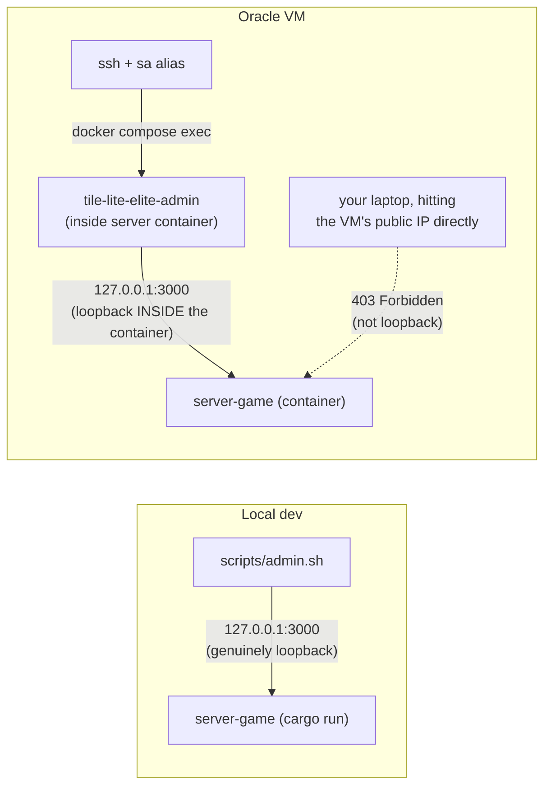

# Production Support & Maintenance

Operating the live system: managing users/games, observing logs, backing up
and (rarely) wiping data. Part of the lifecycle series — see
[docs/README.md](README.md) for the full sequence. Follows
[Deployment](3.4-deployment.md) — this is the ongoing steady state once a
version is live, not a one-time step.

## Admin CLI

The admin CLI — crate `crates/admin-cli`, binary/command name `tile-lite-elite-admin` — is operator tooling for a running server: list/delete users, reset a password, list/delete/force-end games. It's a thin HTTP client against `server-game`'s `/admin/*` endpoints, not a separate implementation, so it can't drift from what the server actually does (cascading deletes, password hashing, etc. all stay server-side).

**There's no admin account or token.** The `/admin/*` endpoints only accept requests whose peer address is loopback (`127.0.0.1`/`::1`), regardless of what `TILE_LITE_ELITE_BIND` is set to — running the CLI *from the server's own terminal* is the access control. This matters specifically because `TILE_LITE_ELITE_BIND=0.0.0.0:3000` (see [Development](3.2-development.md#manual-backend-only)'s LAN-play example) would otherwise expose these endpoints to the whole LAN, not just the machine running the server. It also means where you run `tile-lite-elite-admin` *from* isn't a preference, it's the only thing that determines whether it works at all — the two cases below are genuinely different, not interchangeable:

**Local dev server** (running directly on this machine, not in a container):

```bash
./scripts/admin.sh users list
./scripts/admin.sh users reset-password <player_id>          # prints a generated password
./scripts/admin.sh users reset-password <player_id> --password 'a specific one'
./scripts/admin.sh users delete <player_id>

./scripts/admin.sh games list
./scripts/admin.sh games list --status waiting
./scripts/admin.sh games list --older-than-days 30
./scripts/admin.sh games delete <game_id>
./scripts/admin.sh games force-end <game_id>
```

`scripts/admin.sh` builds `admin-cli` in **release** mode and runs that binary — a plain `cargo run -p admin-cli` builds and runs a *debug* binary instead, which still works but is worth avoiding out of habit now that a script exists to do the right thing by default.

**The Oracle VM's (or any container deployment's) server**: `scripts/admin.sh` can't reach it — it always targets `127.0.0.1`, and that's a different loopback than the VM's, by design (see above; pointing `--server`/`TILE_LITE_ELITE_API_BASE_URL` at the VM's public address from your own machine just gets a 403, it isn't a workaround). Run it *inside* the server container instead, where `127.0.0.1` genuinely is that container. An alias `sa` has been set up on the VM so it can be called from any directory.

```bash
ssh -i ~/.ssh/oracle_tile_lite_elite ubuntu@129.151.69.246
sa games list
cd ~/tile-lite-elite
docker compose exec server tile-lite-elite-admin games list
```



That binary is the release build baked into the `runtime-server` image by the `Dockerfile` — there's nothing extra to build or configure on the VM itself.

Deleting a user unclaims their seats (`player_id` set to null on `game_participants`) rather than deleting their games — game history and other players' records survive.

## Logging

`server-game` uses `tracing`, not `eprintln!`. Application-level events (registration, login success/failure, game created/started/finished, invitations, admin actions, move-time-limit retirement) log at `info` by default; per-HTTP-request spans (method, path, status, latency) from `tower-http`'s `TraceLayer` log at `debug` and are off by default to keep normal output readable.

```bash
# Default verbosity — app events, no per-request noise
cargo run -p server-game

# See per-request HTTP tracing too
RUST_LOG=server_game=info,tower_http=debug cargo run -p server-game

# Everything, very verbose
RUST_LOG=debug cargo run -p server-game
```

Failed logins log the attempted display name (never the password) at `warn`, along with the reason (unknown name vs. wrong password) — visible only to whoever can read the server's own logs, so it doesn't weaken the login endpoint's existing anti-enumeration behavior (the client always gets the same generic error either way). Admin actions (`admin_delete_user`, `admin_reset_password`, `admin_delete_game`, `admin_force_end_game`) log at `warn` specifically so they stand out as an audit trail even at default verbosity.

In the container deployment, this all goes to `docker compose logs server` (or `-f` to follow); `RUST_LOG` can be set as an extra `environment:` entry in `docker-compose.yml`'s `server` service if you need more/less than the default.

## Backups

SQLite lives on a named volume (`tile-lite-elite-data` in production, `tile-lite-elite-staging-data` in staging — see [4.1 Configuration](4.1-configuration.md#environments)). Back it up with:

```bash
docker run --rm -v tile-lite-elite-data:/data -v "$PWD":/backup debian \
  tar czf /backup/tile-lite-elite-data-$(date +%Y%m%d).tgz -C /data .
```

Swap the volume name for `tile-lite-elite-staging-data` to back up staging instead. Restoring is the reverse: stop the stack, extract the tarball's contents into the volume, start it again.

## Wiping production

Real, versioned migrations apply automatically on startup, so **wiping the database is no longer a normal part of shipping a schema change** — see [4.2 Database Schema](4.2-database-schema.md)'s "Schema migrations" note for the incident history behind that fix. The only remaining case for wiping production is a genuine "start over" decision (e.g. pre-launch testing), and even then, back up first:

```bash
ssh tile-lite-elite
cd ~/tile-lite-elite

# 1. Stop services — leaves the named volumes untouched, just stops the
#    containers so nothing's writing to the DB while you back it up.
docker compose down

# 2. Full backup of the data volume (see Backups above).
docker run --rm -v tile-lite-elite-data:/data -v "$PWD":/backup debian \
  tar czf /backup/tile-lite-elite-data-$(date +%Y%m%d).tgz -C /data .

# 3. Clear the DB from the volume so the new server starts fresh
#    (create_if_missing(true) recreates it, migrations included, on next
#    start). Renaming aside instead of deleting, if you'd rather keep a
#    copy in place as well as the tarball:
docker run --rm -v tile-lite-elite-data:/data debian \
  sh -c 'rm -f /data/tile-lite-elite.sqlite3 /data/tile-lite-elite.sqlite3-wal /data/tile-lite-elite.sqlite3-shm'
```
