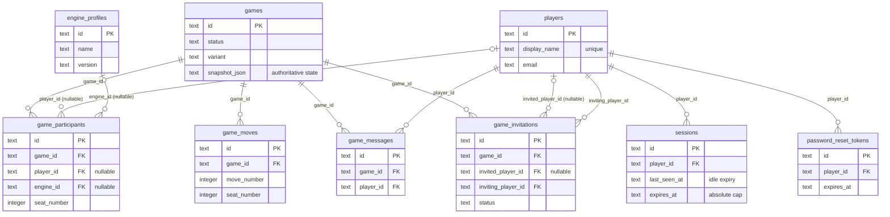

# Database Schema

This is a first-pass SQLite schema for the project.

The goal is to keep the database simple enough for local use and free or near-free self-hosting, while still supporting game history, reconnects, engine-vs-engine play, and saved matches.

## Entity Relationship Diagram

The 9 tables actually created by `crates/server-game/migrations/0001_baseline.sql` (see [Actual Current Shape](#actual-current-shape) below) — `game_state_snapshots` and `saved_games` are proposals, not implemented, and are omitted here.

These are the *logical* relationships described in [Core Tables](#core-tables) below and in [Suggested Relationships](#suggested-relationships) — **not enforced SQL constraints**. `0001_baseline.sql` has no `foreign key ... references ...` clauses at all, and `foreign_keys` isn't turned on either; see [4.1 Configuration](4.1-configuration.md#sqlite)'s "Infrastructure Configuration" section for the full finding and why fixing it is schema-migration-sized work, not done yet.

## Design Principles

- Keep the server authoritative.
- Store durable state in SQLite.
- Keep transient previews and search state out of the database.
- Prefer a few explicit tables over a large nested blob when the data is queried often.
- Use JSON only where the structure is naturally variable or best treated as a snapshot.

## Core Tables

### `games`
One row per game.

Fields:

- `id` text primary key — the game's id, a UUID v4 generated at creation. Used directly as the `GET /games/{id}` path parameter.
- `created_at` text not null — set once, on the first `save_game` call for this id (game creation).
- `started_at` text null — set the moment `status` first becomes anything other than `waiting` (bound to `now` on every save while not `waiting`, so it's technically rewritten each save, not just the first transition — but the value stays correct since `now` only matters the first time this fires).
- `ended_at` text null — set the moment `status` first becomes `finished`, same pattern as `started_at`. Read back by `list_finished_game_ids_older_than` for move-time-limit/retention cleanup.
- `status` text not null — `waiting`, `active`, `finished`, or `aborted` (creator-cancelled). Mirrors `GameSession.status`, rewritten on every `save_game` call.
- `variant` text not null — the edition name (e.g. `official`, `wordfeud`, `north_american`). Mirrors `GameSession.variant`.
- `language` text not null — the dictionary/language for this game (e.g. `sowpods`, `german`, `spanish`). Mirrors `GameSession.language`.
- `board_layout` text not null — the board layout name. Mirrors `GameSession.board_layout`.
- `turn_number` integer not null — mirrors `GameSession.turn_number`.
- `current_seat` integer not null — mirrors `GameSession.current_seat`.
- `winner_seat` integer null — mirrors `GameSession.winner_seat`; set once the game finishes with a single clear winner (not set for a tie).
- `random_seed` integer null — the RNG seed the tile bag was shuffled with at creation. Mirrors `GameSession.random_seed`.
- `snapshot_json` text not null — the actual authoritative game state (full board, racks, bag, move history, per-seat `resigned`/`removed_by_player`/`invited_email`, etc.), deserialized as `PersistedGame`. Every other column on this table, plus `game_participants`/`game_moves` below, is a denormalized read-optimization derived from this blob, not a second source of truth — reloading a game (`load_game`) reads *only* this column, ignoring every other column entirely.

### `game_participants`
Players or engines assigned to seats in a game — a queryable, denormalized mirror of the participant rows embedded in `games.snapshot_json` (see that column below), rewritten wholesale on every `save_game` call. `snapshot_json` is the actual source of truth for game state (including per-seat fields that aren't mirrored here, like `resigned`, `removed_by_player`, and `invited_email`); this table exists so the server can query across games (last-activity lookups, etc.) without deserializing every snapshot.

Fields:

- `id` text primary key — synthesized as `{game_id}-seat-{seat_number}`, not a UUID; stable across re-saves of the same seat.
- `game_id` text not null foreign key to `games.id`
- `seat_number` integer not null — the seat's position/turn-order index within the game (0-based).
- `kind` text not null, for example `human` or `engine`
- `display_name` text not null — the participant's display name as of the most recent save (an engine's name, or a human player's current `players.display_name` at save time — not re-read live from `players` afterward).
- `player_id` text null — the claiming human player's id; `null` for an engine seat or a still-unclaimed/anonymous human seat.
- `engine_id` text null — the assigned engine's id (`engine_profiles.id`); `null` for a human seat.
- `score` integer not null default 0 — the seat's current total score.
- `joined_at` text not null — **effectively meaningless as "when this seat joined"**: every row is deleted and reinserted wholesale on every `save_game` call, so this is always the timestamp of the *most recent* save, not the seat's actual creation time.

Constraints:

- unique `game_id` + `seat_number`

### `game_moves`
Every move or turn action in order — same denormalized-mirror relationship to `snapshot_json` as `game_participants` above (the authoritative `MoveRecord` list lives in the snapshot; this table exists for querying).

Fields:

- `id` text primary key — synthesized as `{game_id}-move-{move_number}`.
- `game_id` text not null foreign key to `games.id`
- `move_number` integer not null — sequential index within the game, starting at 1.
- `seat_number` integer not null — which seat made the move.
- `move_type` text not null, for example `place`, `pass`, `exchange`, `resign`, or `timeout` (an auto-retirement past the move time limit — see [3.5 Production Support & Maintenance](3.5-production-support.md)).
- `payload_json` text not null — the full serialized `MoveRecord` (move type, tiles placed, score delta, human-readable description, etc.) — this, not `score_delta`, is what `MoveRecordDto` is actually built from on read.
- `score_delta` integer not null default 0 — points this specific move scored (0 for a pass/resign/timeout).
- `created_at` text not null — timestamp of the `save_game` call that wrote this row — since moves are only ever appended, this does correctly reflect when the move happened (unlike `game_participants.joined_at`).

Constraints:

- unique `game_id` + `move_number`

### `game_messages`
In-game chat, one row per message.

Fields:

- `id` text primary key — a UUID v4, generated client-request-time when the message is sent (`ChatMessageRecord.id`).
- `game_id` text not null foreign key to `games.id`
- `player_id` text not null — the sender's player id.
- `display_name` text not null (the sender's display name at send time — not re-derived from `players` on read, so a later display-name change doesn't rewrite chat history)
- `body` text not null — the message text, as submitted, no server-side transformation.
- `created_at` text not null — when the message was sent (not a save timestamp — unlike `game_moves`/`game_participants`, chat rows are only ever appended, never rewritten).

### `game_invitations`
One row per invitation ever sent for a seat (a seat's full history — send, decline, resend — isn't overwritten, just appended). See `2.7-authentication-and-invitations.md` for the full seat-claim/invitation model this backs.

Fields:

- `id` text primary key — a UUID v4, generated when the invitation is created.
- `game_id` text not null foreign key to `games.id`
- `invited_player_id` text null — the specific invitee for a `Named` invitation; `null` for an `Open` invitation (any signed-in player may accept) or an `Email` invitation before it's been claimed
- `inviting_player_id` text not null — the creator/roster-manager who sent this invitation.
- `seat_number` integer not null — which seat this invitation is for.
- `status` text not null — `pending`, `accepted`, `rejected`, or `cancelled`. Always inserted as `pending`; updated in place as the invitee (or the roster manager, for `cancelled`) responds.
- `created_at` text not null
- `responded_at` text null — set the moment `status` leaves `pending`.
- `invited_email` text null — set only for an `Email`-claim invitation (the address its join link was sent to). Distinguishes it from a plain `Open` invitation, which also has `invited_player_id is null` until claimed: `get_open_invitations` (the query behind the games list's generic "open invitations" section, visible to every signed-in player) explicitly excludes rows where this is set, since an email invite is only supposed to be reachable via its mailed link, not general browsing.

### `password_reset_tokens`
Single-use "forgot password" tokens — mirrors `sessions`'s hashed-secret shape rather than `game_invitations`'s plain-id shape, since a reset token is an unguessable secret, never used as a REST resource id.

Fields:

- `id` text primary key — a UUID v4.
- `player_id` text not null
- `token_hash` text not null — sha256 hash of the actual reset token; the raw token itself only ever exists in the emailed link, never persisted.
- `created_at` text not null
- `expires_at` text not null (1 hour after creation)
- `consumed_at` text null — set once the token is actually used to reset the password; a token that's already consumed (or past `expires_at`) is rejected on reuse.

### `game_state_snapshots` — not implemented
Not created by `persistence::migrate()`; described here only as a possible future addition (optional saved snapshots for replay, restore, or debugging) if `snapshot_json`'s current live-state-only approach ever needs point-in-time history. Read this section as a proposal, not a description of the current schema — field descriptions below are what they'd presumably hold, not verified against any code.

Fields:

- `id` text primary key — presumably a UUID v4, matching every other table's convention.
- `game_id` text not null foreign key to `games.id`
- `move_number` integer not null — which point in the game this snapshot captures.
- `board_json` text not null — board state at that move.
- `bag_json` text not null — remaining tile bag at that move.
- `racks_json` text not null — every seat's rack at that move.
- `created_at` text not null

Constraints:

- unique `game_id` + `move_number`

### `engine_profiles`
Registered engine metadata.

Fields:

- `id` text primary key — the engine's stable identifier (e.g. `greedy`), matching `EngineRegistry`'s keys and `EngineProfileDto.id`.
- `name` text not null
- `version` text not null
- `author` text null
- `description` text null
- `capabilities_json` text not null — serialized `{supports_timed_play, supports_analysis, supports_ranking}`, matching `EngineProfileDto`'s three boolean fields.
- `created_at` text not null
- `updated_at` text not null — every row is upserted (insert-or-update) once per server startup (`AppState::new` calls `upsert_engine_profiles` with the in-process `EngineRegistry`'s current metadata), so this timestamp reflects "last server restart," not "last time this engine's code actually changed."

### `players`
Persistent player identity records.

Fields:

- `id` text primary key — a UUID v4, generated at registration.
- `display_name` text not null, **unique** (enforced at the DB level — two players cannot register the same display name)
- `email` text not null — **not unique** — multiple accounts can share an email address, confirmed intentional (the project owner tests with multiple identities under one inbox).
- `email_verification_code_hash` text null — schema exists, but **no code path currently sets or reads it** — email verification isn't implemented yet (see [1.4 Roadmap](1.4-roadmap.md)).
- `email_verification_sent_at` text null — same, unused.
- `email_verified_at` text null — same, unused.
- `password_hash` text not null (argon2; see `2.5-authentication.md`)
- `created_at` text not null
- `updated_at` text not null — bumped by `update_player_password`/`update_player_details`.
- `last_seen_at` text null — **dead column in practice**: every read includes it, but no `insert`/`update` statement anywhere in `persistence.rs` ever sets it to anything other than its initial `NULL` — it never actually reflects real recent activity.
- `preferences_json` text null — schema exists, but **no code path currently sets or reads it** — no player-preferences feature exists yet.

### `saved_games` — not implemented
Not created by `persistence::migrate()` — like `game_state_snapshots` above, a proposal for optional saved-match records beyond the live `games` table, not part of the current schema. Field descriptions below are presumed, not verified against any code.

Fields:

- `id` text primary key — presumably a UUID v4.
- `game_id` text not null foreign key to `games.id`
- `label` text null — a user-supplied name for the saved copy.
- `saved_at` text not null
- `snapshot_json` text not null — presumably the same `PersistedGame` shape as `games.snapshot_json`, frozen at save time.

### `sessions`
Lightweight reconnect and presence records.

Fields:

- `id` text primary key — a UUID v4, doubles as the browser's/desktop client's locally-stored session identifier.
- `player_id` text not null foreign key to `players.id`
- `token_hash` text null — sha256 hash of the bearer token handed to the client; the raw token is never stored, only ever returned once at login/register time.
- `created_at` text not null
- `last_seen_at` text not null — the session's last authenticated activity (unix seconds). `player_id_for_token` bumps it on each authenticated request, throttled by `LAST_SEEN_BUMP_THROTTLE_SECS` so an active session isn't a write per request. Drives **idle expiry**: a session unused for longer than `SESSION_IDLE_WINDOW_SECS` (48h) is rejected on its next request and pruned by `delete_expired_sessions` — this is what finally bounds the previously-immortal `stay_logged_in` rows.
- `expires_at` text null — the session's **absolute cap**. New sessions set it to `created_at + SESSION_MAX_LIFETIME_SECS` (10 days), uniform for every session and never extended, so even a continuously-active session must re-authenticate once past it. Enforced by `player_id_for_token` (rejects the token) and `delete_expired_sessions` (prunes the row), alongside the idle check above. (`null` only on pre-change rows that had no absolute cap — those are now bounded by the idle window instead.)
- `stay_logged_in` integer not null default 0 — **no longer affects server-side expiry** (both limits above are uniform for every session). It's now purely a record of a client-side choice: whether the browser persists the token across a restart, which decides whether reopening skips the login screen. Kept as a readable record of that intent.

## Suggested Relationships

- One game has many participants and many moves (mirrored in `game_participants`/`game_moves`; authoritative in `games.snapshot_json`).
- One game has many chat messages (`game_messages`) and many invitations across its lifetime (`game_invitations`).
- One game may have many snapshots or saved-game records — not implemented, see those two tables' entries above.
- One session belongs to a player.
- One player may have many sessions, and many password-reset tokens, over time.
- Engine metadata is separate from game state so engines can be managed independently.

## Actual Current Shape

The schema is created by `crates/server-game/migrations/0001_baseline.sql`, run automatically at server startup via sqlx's `Migrator` (`persistence::migrate`, a thin wrapper around `sqlx::migrate!("./migrations").run(pool)`). It creates, in order: `players`, `engine_profiles`, `games`, `game_participants`, `game_moves`, `game_messages`, `sessions`, `game_invitations`, `password_reset_tokens`. `game_state_snapshots` and `saved_games` remain proposals, not implemented. The old `schema_migrations` table (dead scaffolding — nothing ever inserted into or read from it) is dropped by this same migration and superseded by sqlx's own tracking table, `_sqlx_migrations`.

**All timestamp columns are `INTEGER` — unix seconds as a plain `i64`, not text.** (The column definitions quoted per-table above still read "text" from `0001`; they're rebuilt to `integer` by `0004` below — the per-column prose predates that migration.) `server-game`'s `now_unix_seconds()` is the single source; the client formats them via `time_format`. This replaced an earlier "unix seconds stored as a `String`" representation that forced a parse on every read and compared as text in SQL.

Three migrations follow the baseline: `0002_player_ratings_and_stats.sql` (the rating/stats tables and columns), `0003_drop_dead_columns.sql`, which drops the columns that were only ever written with a placeholder value and read by nothing — `games.notes`, `game_participants.left_at`, `game_moves.tiles_json`, `game_moves.is_validated`, and `sessions.game_id`. (`last_seen_at` was **not** dropped: on `sessions` it now drives idle-session expiry — see the sessions table above; on `players` it remains read/displayed but unwired.) Finally, `0004_timestamps_to_integer.sql` rebuilds every table so each timestamp column is `INTEGER` rather than `text` (see the note above), recreating each rebuilt table's indexes plus the new `idx_sessions_last_seen_at`. Its copy step `CAST`s the existing text timestamps to integers, and the in-blob timestamps inside `snapshot_json` (which the column migration doesn't touch) are converted on load by a serde string-or-number shim (`game_state::deserialize_i64_flexible`, on `turn_started_at`/`ChatMessageRecord.created_at`) — so this is a **real in-place upgrade, not a wipe**: an existing database, snapshots and all, migrates without data loss.

Beyond the automatic indexes SQLite creates for every `primary key`/`unique` column above, the baseline migration also explicitly creates a handful more, on columns that are looked up often enough to matter once row counts grow past what's convenient to full-scan: `sessions(token_hash)` (checked on every authenticated request), `sessions(expires_at)` and `games(status, ended_at)` (both scanned by the lazy cleanup jobs on every `GET /games`), and `game_invitations(game_id)` / `game_invitations(invited_player_id)` / `game_messages(game_id)` (per-game and per-player lookups). The session idle-cleanup (added with idle expiry) also filters on `last_seen_at`, which is **not** indexed — harmless at this table's size, but an index on it would be the first thing to add if the sessions table ever grows large.

## Notes

The exact representation of `board_json`, `bag_json`, and `racks_json` can evolve.

That data can stay compact and versioned so older games can still be replayed even if the live game model changes later.

**Schema migrations**: real, versioned migrations live in `crates/server-game/migrations/` (see that directory's `README.md` for the rules) and run automatically at server startup. This replaced an ad-hoc `create table if not exists` scheme that only took effect on a *freshly created* database file — an existing on-disk database silently kept its old schema, which bit production three times, most recently when `sessions.stay_logged_in` was added but the column never actually reached the already-running production database until a later, unrelated deploy broke every authenticated request. sqlx checksums every applied migration: if an already-applied migration file's content changes, the next server start **fails to boot** (`MigrateError::VersionMismatch`) instead of silently doing nothing — a schema change now either applies correctly or the server refuses to start, never a silent no-op.
