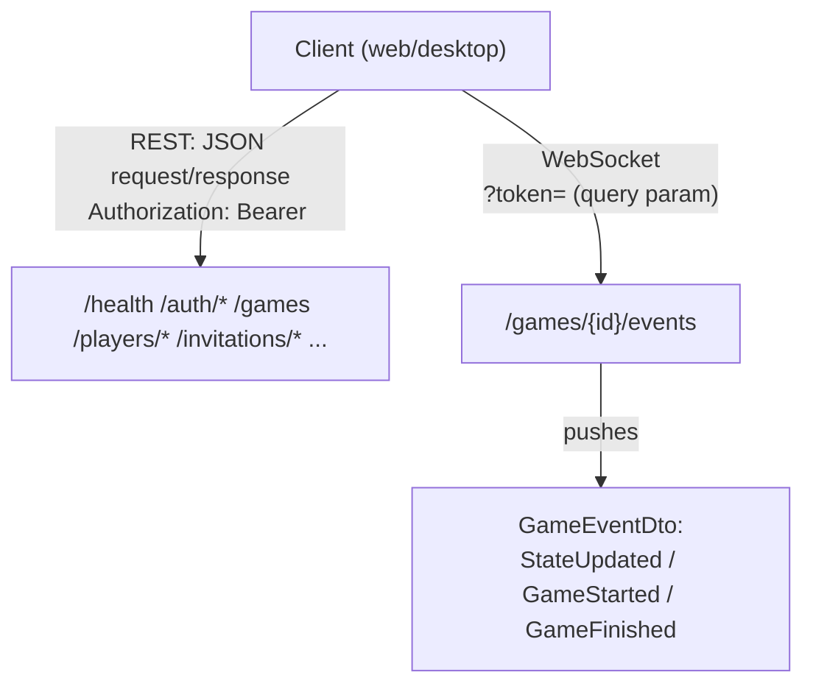
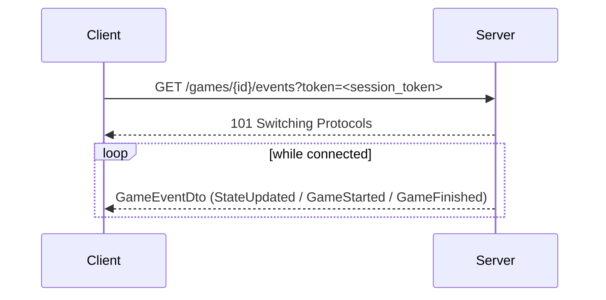

# API Schema

Every HTTP endpoint and wire type `server-game` exposes, as of `api::API_VERSION` `1.1` — generated by reading `crates/api/src/lib.rs` (every DTO) and `crates/server-game/src/app.rs`'s route table directly, not maintained by hand from memory. If this ever drifts from the code, the code wins — re-derive this doc from those two files rather than trusting stale prose here.

This is the flat, structural reference (every route, every field). For narrative walkthroughs of specific flows (register → login → play, the forgot-password round trip), see [2.6 Authentication Examples](2.6-authentication-examples.md) — that doc and this one deliberately overlap on the auth endpoints at different altitudes: this one is "what's the shape," that one is "here's a worked example."

## Protocol Overview

Two protocols, one origin: ordinary REST (JSON over HTTP) for everything except live game updates, which use one WebSocket endpoint. In production/staging both are served by Caddy from the same origin as the static web client — see [3.4 Deployment](3.4-deployment.md#container-deployment).



**Authentication**: a bearer token (`PlayerSessionDto.session_token`, issued by `/auth/register` or `/auth/login`) sent as `Authorization: Bearer <token>` on REST calls. Most endpoints treat it as *optional* — `authenticated_player_id` resolves it to a player id if present and valid, `None` otherwise, and each handler decides whether anonymous access is acceptable for that action (anonymous play still works; seat-ownership checks are what actually require it — see [2.5 Authentication](2.5-authentication.md)). The one exception is the WebSocket endpoint: browsers can't set custom headers on the handshake, so `game_events` reads the token from a `?token=` query parameter instead of the header.

**Errors**: every failure returns a JSON body `{"message": "<string>"}` (`ApiError`) with a matching HTTP status — `400` bad request, `401` unauthorized, `403` forbidden, `404` not found, `500` internal (wraps a `sqlx::Error`). There's no machine-readable error code beyond the status; the message is human-readable, not meant to be pattern-matched by clients.

**`/admin/*`**: a separate concern from the above — loopback-only (rejected for any non-`127.0.0.1`/`::1` peer, regardless of `Authorization`), not part of the player-facing auth model at all. See [3.5 Production Support & Maintenance](3.5-production-support.md#admin-cli).

## Endpoints

Auth column: **—** none checked · **opt** bearer token read if present, several behaviors depend on it · **req** bearer token required, rejected without one · **loopback** `/admin/*`'s own guard, not bearer-based.

### Meta

| Method | Path | Auth | Request | Response |
|---|---|---|---|---|
| GET | `/health` | — | — | `HealthDto` |
| GET | `/engines` | — | — | `Vec<EngineProfileDto>` |
| GET | `/dictionaries/{name}` | — | — | `text/plain` word list (`sowpods`/`enable2k`/`german`/`spanish`) |

### Auth

| Method | Path | Auth | Request | Response |
|---|---|---|---|---|
| POST | `/auth/register` | — | `RegisterPlayerRequest` | `PlayerSessionDto` |
| POST | `/auth/login` | — | `LoginPlayerRequest` | `PlayerSessionDto` |
| POST | `/auth/validate` | — | `ValidateSessionRequest` | `PlayerDto` |
| POST | `/auth/change-password` | req | `ChangePasswordRequest` | `204 No Content` |
| POST | `/auth/update-details` | req | `UpdatePlayerDetailsRequest` | `PlayerDto` |
| POST | `/auth/forgot-password` | — | `RequestPasswordResetRequest` | `204 No Content` (always, non-enumerating) |
| POST | `/auth/reset-password` | — | `ResetPasswordRequest` | `204 No Content` |
| GET | `/players/search?q=` | opt | — | `Vec<String>` (display names, prefix match) |

### Games

| Method | Path | Auth | Request | Response |
|---|---|---|---|---|
| POST | `/games` | opt | `CreateGameRequest` | `GameStateDto` |
| GET | `/games` | opt | — | `Vec<GameSummaryDto>` |
| GET | `/games/{id}` | opt | — | `GameStateDto` |
| POST | `/games/{id}/start` | opt | `StartGameRequest` (empty) | `GameStateDto` |
| POST | `/games/{id}/reorder-seats` | opt | `SwapSeatsRequest` | `GameStateDto` |
| POST | `/games/{id}/actions` | opt | `GameActionRequest` | `GameStateDto` |
| POST | `/games/{id}/chat` | opt | `PostChatMessageRequest` | `GameStateDto` |
| POST | `/games/{id}/remove` | opt | — | `{}` (opaque JSON) |
| POST | `/games/{id}/preview` | opt | `PreviewMoveRequest` | `PreviewMoveResponse` |
| POST | `/games/{id}/suggest` | opt | — | `GameStateDto` (engine's suggested move applied) |
| GET | `/games/{id}/events` | opt (query `?token=`) | — | WebSocket upgrade → `GameEventDto` stream |

### Seats & Roster (pre-start only, except force-resign)

| Method | Path | Auth | Request | Response |
|---|---|---|---|---|
| POST | `/games/{id}/seats` | opt | `CreateSeatRequest` | `GameStateDto` |
| POST | `/games/{id}/seats/{n}/remove` | opt | — | `GameStateDto` |
| POST | `/games/{id}/seats/{n}/withdraw` | opt | — | `GameStateDto` |
| POST | `/games/{id}/seats/{n}/force-resign` | opt | — | `GameStateDto` (mid-game, unresponsive opponent) |

### Invitations

| Method | Path | Auth | Request | Response |
|---|---|---|---|---|
| POST | `/games/{id}/invite` | opt | `InvitePlayerRequest` | `GameInvitationDto` |
| GET | `/players/{player_id}/invitations` | — | — | `Vec<GameInvitationDto>` |
| GET | `/invitations/{id}/preview` | — | — | `InvitationPreviewDto` (unauthenticated — the emailed join link's landing page) |
| POST | `/invitations/{id}/accept` | opt | — | `GameStateDto` |
| POST | `/invitations/{id}/reject` | opt | — | `{}` (opaque JSON) |

See [2.7 Authentication and Invitations](2.7-authentication-and-invitations.md) for the full Named/Open/Email seat-claim model these back.

### Admin (loopback only)

| Method | Path | Request | Response |
|---|---|---|---|
| GET | `/admin/users` | — | `Vec<PlayerDto>` |
| DELETE | `/admin/users/{player_id}` | — | `204 No Content` |
| POST | `/admin/users/{player_id}/reset-password` | `AdminResetPasswordRequest` | `204 No Content` |
| GET | `/admin/games` | — (query: `status`, `older_than_days`) | `Vec<AdminGameSummaryDto>` |
| DELETE | `/admin/games/{game_id}` | — | `204 No Content` |
| POST | `/admin/games/{game_id}/force-end` | — | `GameStateDto` |

## WebSocket: `/games/{id}/events`



One event type, three tags (`#[serde(tag = "type")]`), all three carrying the full current `GameStateDto` rather than a diff — the client always replaces its local state wholesale, never patches it. Every state-changing REST call broadcasts to every connection watching that game, so any client with the socket open sees other players' moves without polling.

## DTO Reference

Field lists only — see `crates/api/src/lib.rs` for the doc comments explaining *why* a field exists; that source is the canonical explanation, not duplicated here. `Option<T>` fields are nullable; enums use `#[serde(rename_all = "snake_case")]` unless noted.

**Core game domain**

```
GameStateDto      { id, status: GameStatus, creator_player_id: Option<String>, variant, language,
                    board_layout, turn_number, current_seat, winner_seat: Option<u8>,
                    final_bonus_seat: Option<u8>, final_bonus_points: Option<i32>, bag_count,
                    move_time_limit_seconds, turn_started_at, participants: Vec<ParticipantDto>,
                    board: Vec<BoardCellDto>, racks: Vec<RackDto> (redacted per-viewer),
                    moves: Vec<MoveRecordDto>, messages: Vec<ChatMessageDto> (empty unless seated) }

GameSummaryDto    { id, status, variant, current_seat, participants: Vec<ParticipantDto>,
                    last_activity_at, move_time_limit_seconds, turn_started_at,
                    relationship: GameRelationship, invitation_id: Option<String>,
                    last_message_at: Option<String> }

ParticipantDto    { seat_number, kind: SeatKind, display_name, player_id: Option<String>,
                    engine_id: Option<String>, score, invitation_status: Option<SeatInvitationStatus>,
                    invited_email: Option<String> }

GameStatus        = Waiting | Active | Finished
SeatKind          = Human | Engine
GameRelationship  = YourTurn | Participant | Creator | InvitedByName | InvitedOpen
SeatInvitationStatus = NotSent | Pending | Rejected

BoardCellDto      { premium: PremiumDto, letter: Option<String>, is_blank: bool }
PremiumDto        = Blank | DoubleLetter | TripleLetter | DoubleWord | TripleWord
RackDto           { counts: Vec<u8>, blanks: u8 }
MoveRecordDto     { move_number, seat_number, move_type: String, main_word: Option<String>,
                    score_delta, positions: Vec<PositionDto>, description }
PositionDto       { x: u8, y: u8 }
```

**Moves & previews**

```
GameActionRequest   { seat_number, action: PlayerActionDto }
PlayerActionDto     = Place { candidate: MoveCandidateDto } | Pass | Exchange { tiles: Vec<TileDto> } | Resign
MoveCandidateDto    { start: PositionDto, direction: DirectionDto, tiles: Vec<TilePlacementDto> }
DirectionDto        = Horizontal | Vertical
TilePlacementDto    { offset: u8, tile: TileDto }
TileDto             = Letter { letter: String } | Blank { acting_as: Option<String> }

PreviewMoveRequest  { seat_number, candidate: MoveCandidateDto }
PreviewMoveResponse { is_legal: bool, headline, detail, score: Option<i16> }
```

**Game/seat creation**

```
CreateGameRequest  { seats: Vec<CreateSeatRequest>, seed: Option<u64>, variant: Option<String>,
                     language: Option<String>, board_layout: Option<String>,
                     move_time_limit_seconds: Option<u64> }
CreateSeatRequest  { kind: SeatKind, display_name, engine_id: Option<String>, claim: Option<SeatClaim> }
SeatClaim          = Creator | Named { display_name } | Open | Email { email }
StartGameRequest   {}  (empty)
SwapSeatsRequest   { seat_a: u8, seat_b: u8 }
```

**Chat**

```
PostChatMessageRequest { body: String }
ChatMessageDto          { id, player_id, display_name, body, created_at }
```

**Authentication**

```
RegisterPlayerRequest        { display_name, email, password, stay_logged_in: bool }
LoginPlayerRequest           { display_name, password, stay_logged_in: bool }
PlayerSessionDto             { player_id, session_token, display_name, email }
ValidateSessionRequest       { session_token }
ChangePasswordRequest        { current_password, new_password }
UpdatePlayerDetailsRequest   { display_name: Option<String>, email: Option<String> }
RequestPasswordResetRequest  { email }
ResetPasswordRequest         { token, new_password }
PlayerDto                    { id, display_name, email, created_at, last_seen_at: Option<String> }
```

**Invitations**

```
InvitePlayerRequest      { invited_display_name: Option<String>, invited_email: Option<String>, seat_number }
GameInvitationDto        { id, game_id, invited_player_id: Option<String>, inviting_player_id,
                           seat_number, status: InvitationStatus, created_at,
                           responded_at: Option<String>, inviting_player_display_name }
InvitationStatus         = Pending | Accepted | Rejected | Cancelled
InvitationPreviewDto     { inviting_player_display_name, status: InvitationStatus }
InvitationResponseRequest { accept: bool }   // defined but not currently routed — accept/reject use dedicated endpoints instead
```

**Meta / versioning**

```
HealthDto    { status: String, api_version: ApiVersion, app_version: String }
ApiVersion   { major: u32, minor: u32 }
ApiError     { message: String }
EngineProfileDto { id, name, version, author: Option<String>, description: Option<String>,
                   supports_timed_play, supports_analysis, supports_ranking }
```

**Admin (loopback only)**

```
AdminGameSummaryDto      { id, status, created_at, last_activity_at, participants: Vec<ParticipantDto> }
AdminResetPasswordRequest { new_password }
```

See [4.1 Configuration](4.1-configuration.md#versioning) for how `ApiVersion` is checked client-side and when to bump it.
