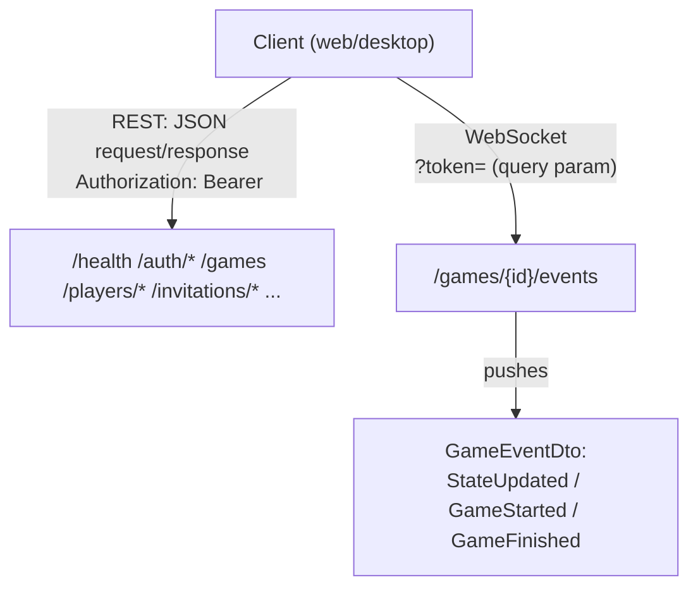
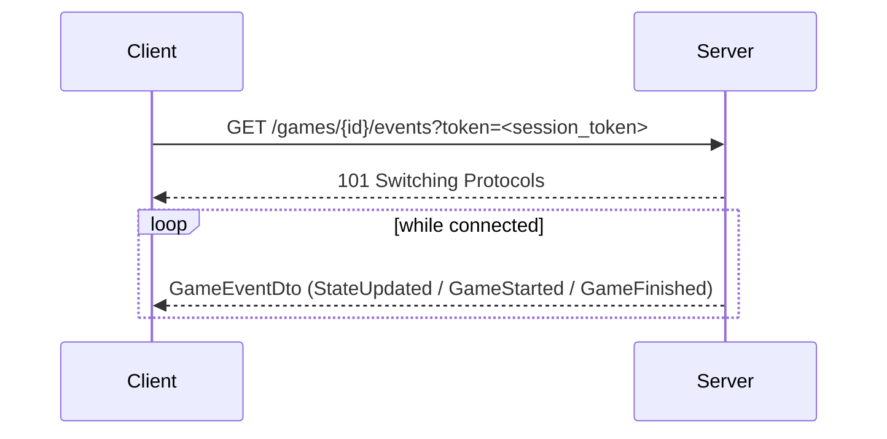
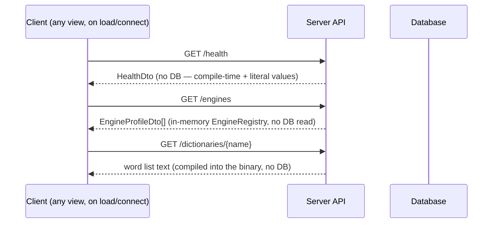
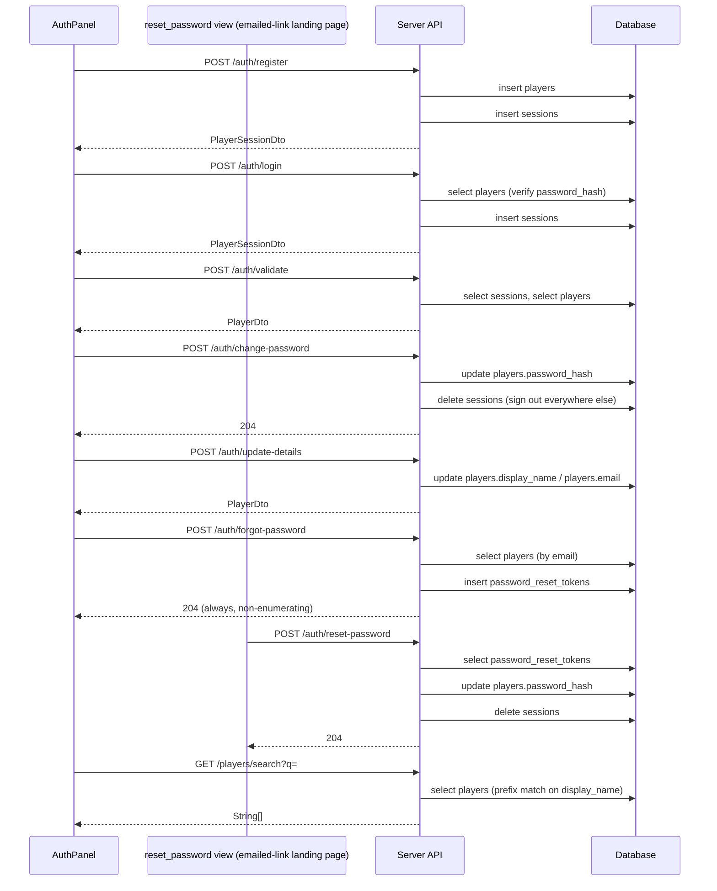
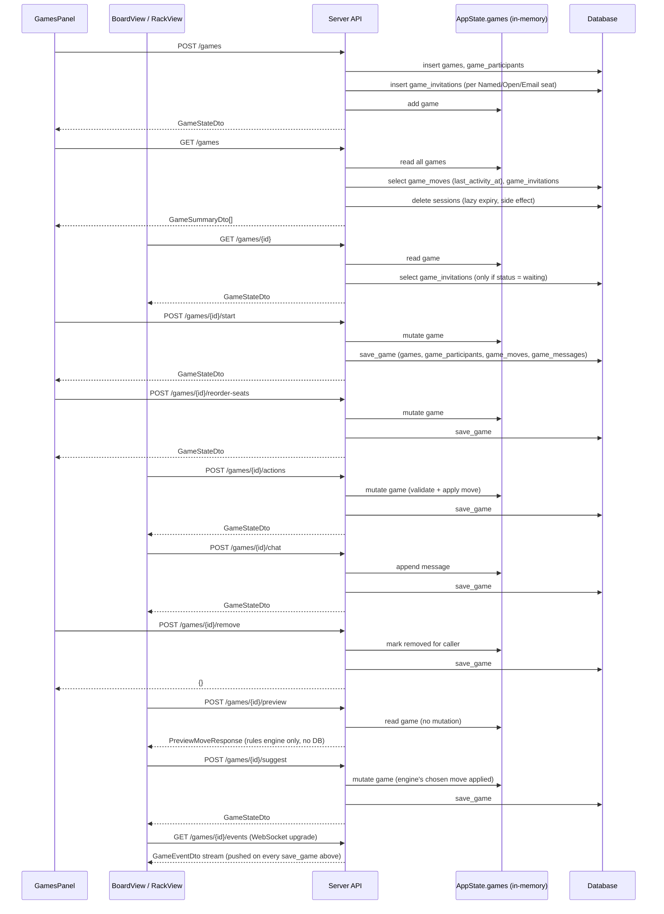
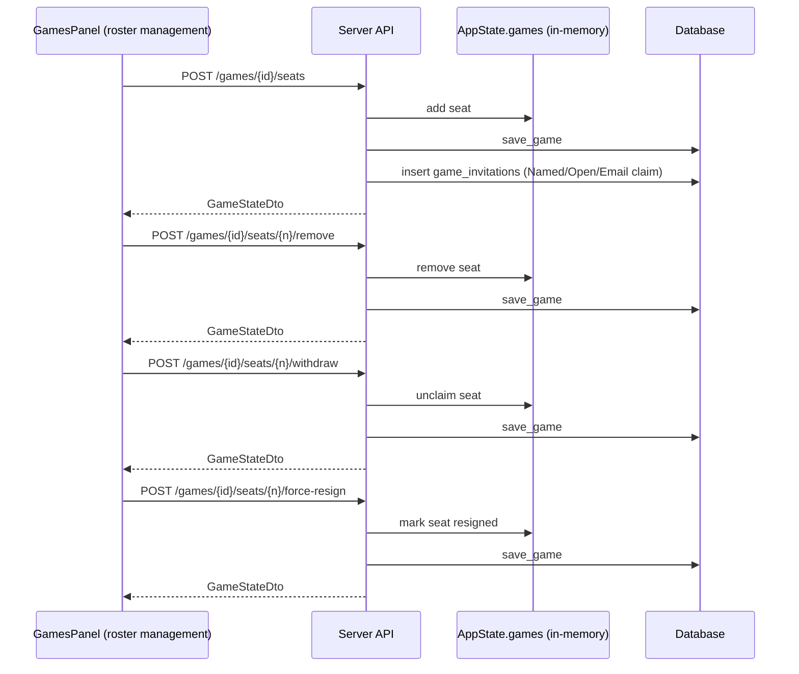
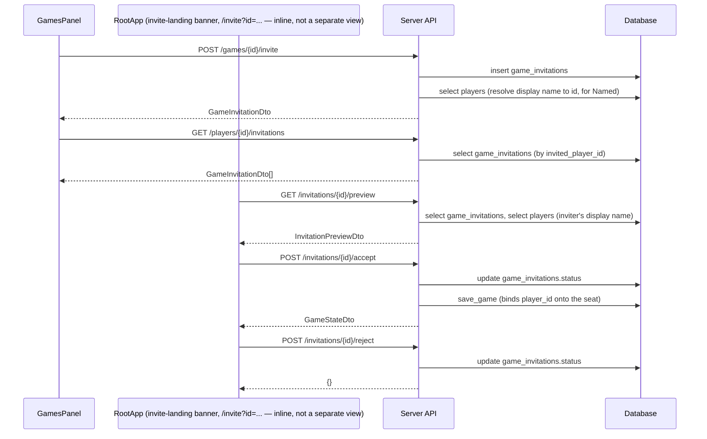
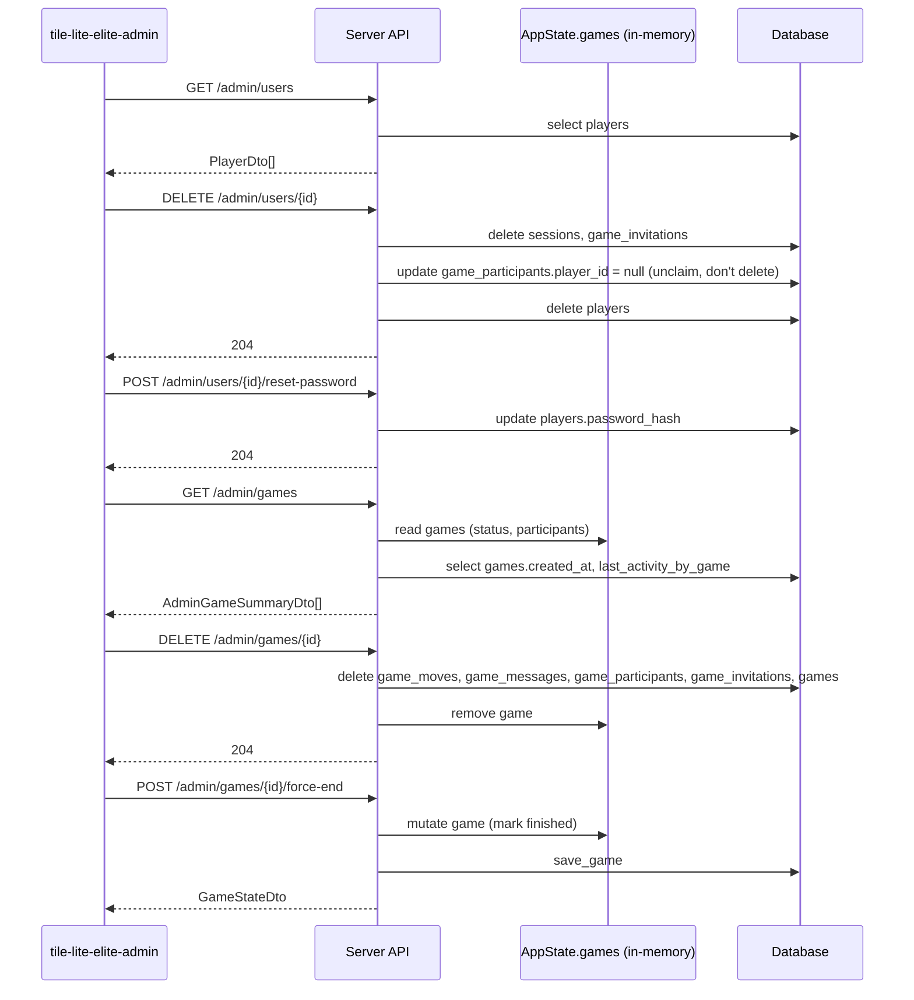

# API Schema

Every HTTP endpoint and wire type `server-game` exposes, as of `api::API_VERSION` `1.1` — generated by reading `crates/api/src/lib.rs` (every DTO) and `crates/server-game/src/app.rs`'s route table directly, not maintained by hand from memory. If this ever drifts from the code, the code wins — re-derive this doc from those two files rather than trusting stale prose here.

This is the flat, structural reference (every route, every field). For narrative walkthroughs of specific flows (register → login → play, the forgot-password round trip), see [2.6 Authentication Examples](2.6-authentication-examples.md) — that doc and this one deliberately overlap on the auth endpoints at different altitudes: this one is "what's the shape," that one is "here's a worked example."

## Protocol Overview

Two protocols, one origin: ordinary REST (JSON over HTTP) for everything except live game updates, which use one WebSocket endpoint. In production/staging both are served by Caddy from the same origin as the static web client — see [3.4 Deployment](3.4-deployment.md#container-deployment).

**Authentication**: a bearer token (`PlayerSessionDto.session_token`, issued by `/auth/register` or `/auth/login`) sent as `Authorization: Bearer <token>` on REST calls. Most endpoints treat it as *optional* — `authenticated_player_id` resolves it to a player id if present and valid, `None` otherwise, and each handler decides whether anonymous access is acceptable for that action (anonymous play still works; seat-ownership checks are what actually require it — see [2.5 Authentication](2.5-authentication.md)). The one exception is the WebSocket endpoint: browsers can't set custom headers on the handshake, so `game_events` reads the token from a `?token=` query parameter instead of the header.

**Errors**: every failure returns a JSON body `{"message": "<string>"}` (`ApiError`) with a matching HTTP status — `400` bad request, `401` unauthorized, `403` forbidden, `404` not found, `500` internal (wraps a `sqlx::Error`). There's no machine-readable error code beyond the status; the message is human-readable, not meant to be pattern-matched by clients.

**`/admin/*`**: a separate concern from the above — loopback-only (rejected for any non-`127.0.0.1`/`::1` peer, regardless of `Authorization`), not part of the player-facing auth model at all. See [3.5 Production Support & Maintenance](3.5-production-support.md#admin-cli).

## Endpoints

Auth column: **—** none checked · **opt** bearer token read if present, several behaviors depend on it · **req** bearer token required, rejected without one · **loopback** `/admin/*`'s own guard, not bearer-based.

### Meta

| Method | Path | Auth | Request | Response |
|---|---|---|---|---|
| GET | `/health` | — | — | `HealthDto` |
| GET | `/engines` | — | — | `Vec<EngineProfileDto>` |
| GET | `/dictionaries/{name}` | — | — | `text/plain` word list (`sowpods`/`enable2k`/`german`/`spanish`) |

### Auth

| Method | Path | Auth | Request | Response |
|---|---|---|---|---|
| POST | `/auth/register` | — | `RegisterPlayerRequest` | `PlayerSessionDto` |
| POST | `/auth/login` | — | `LoginPlayerRequest` | `PlayerSessionDto` |
| POST | `/auth/validate` | — | `ValidateSessionRequest` | `PlayerDto` |
| POST | `/auth/logout` | opt | — | `204 No Content` (deletes the bearer token's session) |
| POST | `/auth/change-password` | req | `ChangePasswordRequest` | `204 No Content` |
| POST | `/auth/update-details` | req | `UpdatePlayerDetailsRequest` | `PlayerDto` |
| POST | `/auth/forgot-password` | — | `RequestPasswordResetRequest` | `204 No Content` (always, non-enumerating) |
| POST | `/auth/reset-password` | — | `ResetPasswordRequest` | `204 No Content` |
| GET | `/players/search?q=` | opt | — | `Vec<String>` (display names, prefix match) |

### Games

| Method | Path | Auth | Request | Response |
|---|---|---|---|---|
| POST | `/games` | opt | `CreateGameRequest` | `GameStateDto` |
| GET | `/games` | opt | — | `Vec<GameSummaryDto>` |
| GET | `/games/{id}` | opt | — | `GameStateDto` |
| POST | `/games/{id}/start` | opt | `StartGameRequest` (empty) | `GameStateDto` |
| POST | `/games/{id}/reorder-seats` | opt | `SwapSeatsRequest` | `GameStateDto` |
| POST | `/games/{id}/actions` | opt | `GameActionRequest` | `GameStateDto` |
| POST | `/games/{id}/chat` | opt | `PostChatMessageRequest` | `GameStateDto` |
| POST | `/games/{id}/remove` | opt | — | `{}` (opaque JSON) |
| POST | `/games/{id}/preview` | opt | `PreviewMoveRequest` | `PreviewMoveResponse` |
| POST | `/games/{id}/suggest` | opt | — | `GameStateDto` (engine's suggested move applied) |
| GET | `/games/{id}/events` | opt (query `?token=`) | — | WebSocket upgrade → `GameEventDto` stream |

### Seats & Roster (pre-start only, except force-resign)

| Method | Path | Auth | Request | Response |
|---|---|---|---|---|
| POST | `/games/{id}/seats` | opt | `CreateSeatRequest` | `GameStateDto` |
| POST | `/games/{id}/seats/{n}/remove` | opt | — | `GameStateDto` |
| POST | `/games/{id}/seats/{n}/withdraw` | opt | — | `GameStateDto` |
| POST | `/games/{id}/seats/{n}/force-resign` | opt | — | `GameStateDto` (mid-game, unresponsive opponent) |
| POST | `/games/{id}/abort` | opt | — | `GameStateDto` (creator cancels the whole game → `status: aborted`) |

### Invitations

| Method | Path | Auth | Request | Response |
|---|---|---|---|---|
| POST | `/games/{id}/invite` | opt | `InvitePlayerRequest` | `GameInvitationDto` |
| GET | `/players/{player_id}/invitations` | — | — | `Vec<GameInvitationDto>` |
| GET | `/invitations/{id}/preview` | — | — | `InvitationPreviewDto` (unauthenticated — the emailed join link's landing page) |
| POST | `/invitations/{id}/accept` | opt | — | `GameStateDto` |
| POST | `/invitations/{id}/reject` | opt | — | `{}` (opaque JSON) |

See [2.7 Authentication and Invitations](2.7-authentication-and-invitations.md) for the full Named/Open/Email seat-claim model these back.

### Admin (loopback only)

| Method | Path | Request | Response |
|---|---|---|---|
| GET | `/admin/users` | — | `Vec<PlayerDto>` |
| DELETE | `/admin/users/{player_id}` | — | `204 No Content` |
| POST | `/admin/users/{player_id}/reset-password` | `AdminResetPasswordRequest` | `204 No Content` |
| GET | `/admin/games` | — (query: `status`, `older_than_days`) | `Vec<AdminGameSummaryDto>` |
| DELETE | `/admin/games/{game_id}` | — | `204 No Content` |
| POST | `/admin/games/{game_id}/force-end` | — | `GameStateDto` |

## WebSocket: `/games/{id}/events`

One event type, three tags (`#[serde(tag = "type")]`), all three carrying the full current `GameStateDto` rather than a diff — the client always replaces its local state wholesale, never patches it. Every state-changing REST call broadcasts to every connection watching that game, so any client with the socket open sees other players' moves without polling.

## DTO Reference

See `crates/api/src/lib.rs` for the doc comments explaining *why* a field exists; that source is the canonical explanation, not duplicated here. `Option<T>` fields are nullable; enums use `#[serde(rename_all = "snake_case")]` unless noted.

**Source** column convention: for a *response* field, where the value actually comes from at read time — a `table.column`, or "calculated" with a one-line note. For a *request* field, what the server does with it (which table it ends up persisted into, or how it's consumed). A recurring, load-bearing fact throughout the game-domain tables below: `GameSession`/`GameStateDto`/`GameSummaryDto`/`MoveRecordDto`/`ChatMessageDto` are built **only** from `games.snapshot_json`, deserialized once into memory — `game_participants`, `game_moves`, and `game_messages` are write-only mirrors from the API's perspective (rewritten on every save for querying/admin use, but never read back to construct a response). See [4.2 Database Schema](4.2-database-schema.md) for the columns those mirror tables actually hold.

### Core game domain

**`GameStateDto`** — built by `GameSession::to_dto` (`game_state.rs`), then `redact_game_state` zeroes/empties a couple of fields per-viewer before the response leaves the server.

| Field | Type | Source |
|---|---|---|
| `id` | `String` | `games.snapshot_json` (`PersistedGame.id`) |
| `status` | `GameStatus` | `games.snapshot_json` |
| `creator_player_id` | `Option<String>` | `games.snapshot_json` |
| `variant` | `String` | `games.snapshot_json` |
| `language` | `String` | `games.snapshot_json` |
| `board_layout` | `String` | `games.snapshot_json` |
| `turn_number` | `i64` | `games.snapshot_json` |
| `current_seat` | `u8` | `games.snapshot_json` |
| `winner_seat` | `Option<u8>` | `games.snapshot_json` |
| `final_bonus_seat` | `Option<u8>` | `games.snapshot_json` |
| `final_bonus_points` | `Option<i32>` | `games.snapshot_json` |
| `bag_count` | `usize` | calculated — `bag.len()`, where `bag` is itself from `games.snapshot_json` |
| `move_time_limit_seconds` | `u64` | `games.snapshot_json` |
| `turn_started_at` | `String` | `games.snapshot_json` |
| `participants` | `Vec<ParticipantDto>` | `games.snapshot_json` (see `ParticipantDto` below for its one calculated field) |
| `board` | `Vec<BoardCellDto>` | calculated — `board_to_dto`, from `games.snapshot_json`'s board plus the compile-time premium-square layout for `board_layout` |
| `racks` | `Vec<RackDto>` | `games.snapshot_json`, **redacted**: `redact_game_state` zeroes every seat's rack except the caller's own |
| `moves` | `Vec<MoveRecordDto>` | `games.snapshot_json` (`game_moves` table is never read for this, despite existing) |
| `messages` | `Vec<ChatMessageDto>` | `games.snapshot_json`, **redacted**: emptied entirely unless the caller holds a seat in this game |

**`GameSummaryDto`** — built by `GameSession::to_summary_dto`, called per-game from the `list_games` handler, which then overwrites `relationship`/`invitation_id` per caller.

| Field | Type | Source |
|---|---|---|
| `id`, `status`, `variant`, `current_seat` | — | `games.snapshot_json` |
| `participants` | `Vec<ParticipantDto>` | `games.snapshot_json`, with `invitation_status` forced to `None` (not meaningful in a list view) |
| `last_activity_at` | `String` | calculated — `persistence::last_activity_by_game`: `max(game_moves.created_at)` for the game, falling back to `games.created_at` if no moves yet (a real read of those two tables, unlike the rest of this DTO) |
| `move_time_limit_seconds`, `turn_started_at` | — | `games.snapshot_json` |
| `last_message_at` | `Option<String>` | calculated — last element of `games.snapshot_json`'s `messages` list |
| `relationship` | `GameRelationship` | calculated in the `list_games` handler, comparing the caller's player id against `games.snapshot_json`'s participants and `game_invitations` |
| `invitation_id` | `Option<String>` | calculated in `list_games`, from `game_invitations`, set only when `relationship` is `InvitedByName`/`InvitedOpen` |

**`ParticipantDto`**

| Field | Type | Source |
|---|---|---|
| `seat_number`, `kind`, `display_name`, `player_id`, `engine_id`, `score`, `invited_email` | — | `games.snapshot_json` |
| `invitation_status` | `Option<SeatInvitationStatus>` | calculated — `attach_invitation_status`, the most recent `game_invitations` row for that seat; always `None` in `GameSummaryDto`'s context, only populated for `GameStateDto` responses where a seat is unclaimed |

`GameStatus`/`SeatKind`/`GameRelationship`/`SeatInvitationStatus`/`PremiumDto` are plain enums carried inline in the DTOs above, not separately sourced.

| DTO | Fields | Source |
|---|---|---|
| `BoardCellDto` | `premium: PremiumDto`, `letter: Option<String>`, `is_blank: bool` | calculated — `board_to_dto`; `premium` from the compile-time board layout, `letter`/`is_blank` from `games.snapshot_json` |
| `RackDto` | `counts: Vec<u8>`, `blanks: u8` | `games.snapshot_json`, redacted (see `GameStateDto.racks` above) |
| `MoveRecordDto` | `move_number`, `seat_number`, `move_type`, `main_word`, `score_delta`, `positions`, `description` | `games.snapshot_json` (`game_moves.payload_json` holds the same shape on disk, but is never read back — see the note at the top of this section) |
| `PositionDto` | `x: u8`, `y: u8` | part of `MoveRecordDto`/`MoveCandidateDto`, same source as its parent |

### Moves & previews

No database involvement at all — legality/scoring is computed live by the rules engine against the in-memory `GameSession`, and a preview is never persisted.

| DTO | Fields | Source |
|---|---|---|
| `GameActionRequest` | `seat_number`, `action: PlayerActionDto` | request only — `action` is applied to the in-memory `GameSession`, then persisted into `games.snapshot_json` (and its mirror tables) by the `save_game` call at the end of the request |
| `PlayerActionDto` | `Place`\|`Pass`\|`Exchange`\|`Resign` | request only |
| `MoveCandidateDto` / `TilePlacementDto` / `TileDto` / `DirectionDto` | — | request only |
| `PreviewMoveRequest` | `seat_number`, `candidate: MoveCandidateDto` | request only, never persisted |
| `PreviewMoveResponse` | `is_legal`, `headline`, `detail`, `score` | calculated — live rules-engine evaluation against current in-memory state; not read from or written to the database |

### Game/seat creation

| DTO | Fields | Source |
|---|---|---|
| `CreateGameRequest` | `seats`, `seed`, `variant`, `language`, `board_layout`, `move_time_limit_seconds` | request only — becomes the initial `games.snapshot_json` on creation |
| `CreateSeatRequest` | `kind`, `display_name`, `engine_id`, `claim: Option<SeatClaim>` | request only — `claim` is consumed immediately: `Creator` binds `games.snapshot_json`'s `creator_player_id` directly, `Named`/`Open`/`Email` each create a `game_invitations` row instead |
| `SeatClaim` | `Creator`\|`Named`\|`Open`\|`Email` | request only, see above |
| `StartGameRequest` | *(empty)* | request only, no fields |
| `SwapSeatsRequest` | `seat_a: u8`, `seat_b: u8` | request only — reorders `games.snapshot_json`'s participant list |

### Chat

| DTO | Fields | Source |
|---|---|---|
| `PostChatMessageRequest` | `body: String` | request only — appended into `games.snapshot_json`'s `messages` list, mirrored into `game_messages` on save |
| `ChatMessageDto` | `id`, `player_id`, `display_name`, `body`, `created_at` | `games.snapshot_json` (`game_messages` table is write-only, same pattern as `game_moves` — never read back) |

### Authentication

| DTO | Fields | Source |
|---|---|---|
| `RegisterPlayerRequest` | `display_name`, `email`, `password`, `stay_logged_in` | request only — `display_name`/`email` inserted into `players`, `password` argon2-hashed into `players.password_hash`, `stay_logged_in` consumed to compute `sessions.expires_at` (never itself stored on `players`) |
| `LoginPlayerRequest` | `display_name`, `password`, `stay_logged_in` | request only — `display_name`/`password` checked against `players`, `stay_logged_in` same as above |
| `PlayerSessionDto` | `player_id` | `players.id` |
| | `session_token` | calculated — a fresh UUID v4, returned once; only its sha256 (`sessions.token_hash`) is ever persisted |
| | `display_name`, `email` | `players.display_name`, `players.email` |
| `ValidateSessionRequest` | `session_token` | request only — hashed and looked up against `sessions.token_hash` |
| `ChangePasswordRequest` | `current_password`, `new_password` | request only — `current_password` checked, `new_password` argon2-hashed into `players.password_hash` |
| `UpdatePlayerDetailsRequest` | `display_name`, `email` | request only — persisted into `players.display_name`/`players.email` (only the `Some` one(s)) |
| `RequestPasswordResetRequest` | `email` | request only — looked up against `players.email`; always `204` regardless of match (non-enumerating) |
| `ResetPasswordRequest` | `token`, `new_password` | request only — `token` hashed and matched against `password_reset_tokens.token_hash`, `new_password` hashed into `players.password_hash` |
| `PlayerDto` | `id`, `display_name`, `email`, `created_at` | `players.id`/`players.display_name`/`players.email`/`players.created_at` |
| | `last_seen_at` | `players.last_seen_at` — **always `null` in practice**, see [4.2 Database Schema](4.2-database-schema.md)'s note on that column |

### Invitations

| DTO | Fields | Source |
|---|---|---|
| `InvitePlayerRequest` | `invited_display_name`, `invited_email`, `seat_number` | request only — creates a `game_invitations` row |
| `GameInvitationDto` | `id`, `game_id`, `invited_player_id`, `inviting_player_id`, `seat_number`, `status`, `created_at`, `responded_at` | `game_invitations`, 1:1 by column name |
| | `inviting_player_display_name` | calculated — looked up from `players.display_name` for `inviting_player_id` at request time, not stored on `game_invitations` itself |
| `InvitationStatus` | `Pending`\|`Accepted`\|`Rejected`\|`Cancelled` | `game_invitations.status` |
| `InvitationPreviewDto` | `inviting_player_display_name`, `status` | same as `GameInvitationDto` above — this is the unauthenticated subset shown on the emailed join link's landing page |

### Meta / versioning

| DTO | Fields | Source |
|---|---|---|
| `HealthDto` | `status` | calculated — the literal string `"ok"` |
| | `api_version` | compile-time constant, `api::API_VERSION` |
| | `app_version` | compile-time — `Cargo.toml`'s `version` plus `TILE_LITE_ELITE_BUILD_ID` if set at build time (see [4.1 Configuration](4.1-configuration.md#versioning)) |
| `ApiVersion` | `major`, `minor` | compile-time constant, part of `HealthDto`/version-check responses |
| `ApiError` | `message` | calculated — the specific error message for whatever failed; never DB-sourced |
| `EngineProfileDto` | `id`, `name`, `version`, `author`, `description` | **in-memory `EngineRegistry`**, not the database — `GET /engines` reads `state.engines.metadata()` directly. `engine_profiles` is written to (upserted once per server startup) but never read back; it exists for potential future querying, not current use |
| | `supports_timed_play`, `supports_analysis`, `supports_ranking` | same — in-memory `EngineRegistry` (mirrored into `engine_profiles.capabilities_json` on write, but that mirror is never read) |

### Admin (loopback only)

| DTO | Fields | Source |
|---|---|---|
| `AdminGameSummaryDto` | `id`, `status`, `participants` | in-memory `state.games` (itself from `games.snapshot_json`) |
| | `created_at` | calculated — `persistence::created_at_by_game`, a real `select id, created_at from games` (unlike the player-facing DTOs, admin listing does read this column back) |
| | `last_activity_at` | calculated — `persistence::last_activity_by_game`, same query as `GameSummaryDto.last_activity_at` above |
| `AdminResetPasswordRequest` | `new_password` | request only — argon2-hashed into `players.password_hash`, bypassing the normal `current_password` check (loopback-only access is the authorization instead) |

See [4.1 Configuration](4.1-configuration.md#versioning) for how `ApiVersion` is checked client-side and when to bump it.

## Sequence Diagrams: Every Endpoint, With Context

One diagram per group from [Endpoints](#endpoints) above, each showing the UI side that actually calls it (`crates/ui/src/components/`/`views/`, verified by reading the client code, not assumed), the server handler, and which table(s) it reads from or writes to — matching the **Source** columns in [DTO Reference](#dto-reference). Where a call is served entirely from the in-memory `AppState.games` map rather than a real query, the diagram says so explicitly rather than drawing an arrow to a table that isn't actually touched.

### Meta

### Authentication

### Games

### Seats & Roster

### Invitations

### Admin (loopback only — no UI, `tile-lite-elite-admin` CLI)

