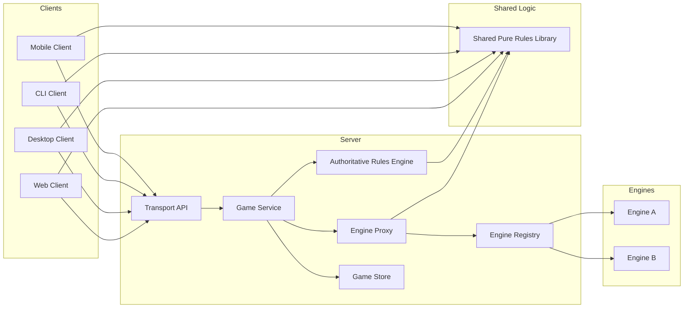
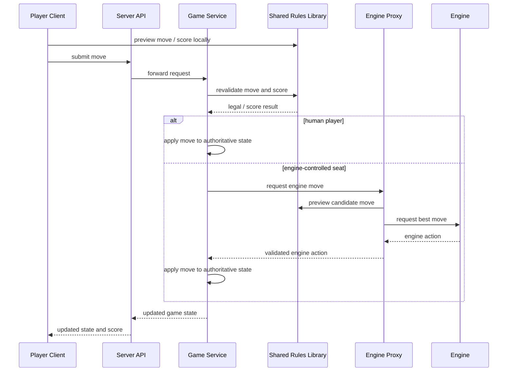

# Components And Interactions

This document sketches the first-pass component model and the main interaction flows for the final Scrabble system.

## Component Diagram

## Interaction Diagram: Playing A Move

## Interaction Notes

- The shared rules library is compiled into the client, the server, and the engine proxy.
- The shared rules library includes the per-language word list; current support is SOWPODS.
- The rules layer and the engine layer are separate concerns; engines can use rules data as input, but engine search state is not part of the shared rules model.
- The server remains authoritative for the final legality and scoring decision.
- Clients and proxies use shared rules only for prediction, feedback, and move evaluation before submission.
- Engine-vs-engine games use the same proxy path as human-vs-engine games.
